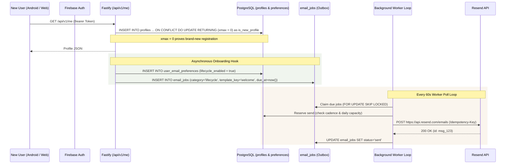

# WritOn Email & Writer Engagement Subsystem — Architecture & AI Operations Guide

> **Target Audience**: AI Agents (Antigravity, Copilot, Gemini Spark), Backend Engineers, and System Operators.  
> **Status (checked 2026-10-01)**: Email tables exist in production, but hosted welcome delivery is not verified or reliably configured. Local repair is awaiting deployment; the configured Resend key returned HTTP 401. Do not equate seeded records or provider acceptance with inbox receipt.
> **Core Principle**: Zero tracking pixels, Warm Parchment (`#FAF5EE`) editorial aesthetic, strict legal privacy compliance (GDPR / CAN-SPAM / DPDP), atomic PostgreSQL deduplication (`FOR UPDATE SKIP LOCKED`).

---

## 1. System Overview & Invariants

The WritOn Email Subsystem handles two classes of emails:
1. **Essential Account Mail**: Email Verification and Password Reset (rate-limited, outside marketing caps, no marketing inserts).
2. **Discretionary / Engagement Mail**: Onboarding Welcome, Weekly Reading Digest, Writer Weekly Digest & Stats, Milestone/Activity notifications, and Gentle Return invitations.

### Core Operating Invariants:
* **One-Discretionary-Email-Per-7-Days**: No user may receive more than one discretionary email across all categories within a rolling 7-day window.
* **Explicit Opt-In Default**: Registration or push subscription NEVER implies email marketing consent. `user_email_preferences` defaults to `false` across `reading`, `activity`, `lifecycle`, and `writer_tips`.
* **Zero Tracking Pixels**: Never inject 1x1 tracking pixels, link-tracking redirect wrappers, or fake urgency counters. Preserve clean typography.
* **Warm Parchment Aesthetic**: `#FAF5EE` ivory canvas, `#30271F` ink, Georgia/book-serif headings, `#9C3E1D` terracotta buttons, and generous whitespace.

---

## 2. Database Schema (`server/migrations/20260916_email_engagement.sql`)

The schema lives in the production PostgreSQL database (`rrxaitxeirykmiihgiqj`):

| Table Name | Primary Key | Purpose | Key Constraints |
|---|---|---|---|
| `public.user_email_preferences` | `profile_id` (`TEXT`) | Opt-in preferences for reading, activity, lifecycle, writer_tips | Cascade delete from `public.profiles(id)` |
| `public.email_jobs` | `id` (`UUID`) | Durable queue with lease tokens and retry states | `UNIQUE(profile_id, event_key, template_key, template_version)` |
| `public.email_delivery_events` | `provider_event_id` (`TEXT`) | Ingested Resend webhooks log | Idempotent duplicate event detection |
| `public.email_suppressions` | `recipient_fingerprint` (`TEXT`) | SHA-256 email hash suppression (hard bounces, complaints) | Overrides all user consent |
| `public.email_daily_capacity` | `capacity_date` (`DATE`) | Daily send volume tracker (default 80 sends/day ceiling) | Atomic increment under lock |
| `public.email_preference_audit` | `id` (`BIGSERIAL`) | Append-only consent modification audit ledger | Stores `before_state` and `after_state` JSONB |
| `public.writer_engagement_events` | `id` (`UUID`) | Tracks `story_share_initiated` and milestone crossing events | `story_id REFERENCES public.posts(id) ON DELETE SET NULL` |

---

## 3. Current User State & Privacy Compliance

* **Baseline**: 3,980 total human profiles (3,708 with an email address).
* **Consent Initialization**: All 3,980 existing profiles have rows seeded in `public.user_email_preferences` with:
  ```json
  {
    "reading_enabled": false,
    "activity_enabled": false,
    "lifecycle_enabled": false,
    "writer_tips_enabled": false,
    "locale": "en",
    "timezone": "Asia/Kolkata"
  }
  ```
* **Enabling Existing Users**: To begin receiving discretionary digests, existing users must opt in via `/api/v1/me/email-preferences` in settings.

---

## 4. Automated New Joiner Welcome Pipeline

### Flow Diagram:


### Key Implementation Details:
* **Hook Location**: `ensureProfileForId` in [`server/src/server.js`](file:///d:/VibeCode/WritOn-PowerUp/server/src/server.js). Local repair awaits queueing before returning rather than abandoning an unawaited promise; queue failures are logged without rejecting registration.
* **Consent gate**: Existing opt-outs and withdrawals are preserved. Signup's historical lifecycle default is not consent evidence; optional delivery requires `consented_at` and no withdrawal. Do not backfill consent timestamps for these new users.
* **Repair route (local, not deployed)**: Admin-only `POST /api/v1/internal/jobs/reconcile-welcome-emails`, bounded to 1–30 days and 1–100 profiles, defaults to `dryRun=true`. Selects recent verified human profiles with recorded lifecycle consent and no existing welcome job. It does not send or revive cancelled/ambiguous jobs.
* **Helper**: `enqueueWelcomeEmail(pool, config, { profileId, recipientEmail, fullName })` in [`server/src/email/queue.js`](file:///d:/VibeCode/WritOn-PowerUp/server/src/email/queue.js).
* **Welcome Template Model**:
  - **Subject**: `"Welcome to WritOn"`
  - **Opening Copy**: *"A quiet home for slow reading and deliberate writing. Start with a story, or write your first line. There is no need to do both today."*
  - **Craft Principle Box**: *"Write Your Opening Sentence Last — Don't let perfectionism stall your draft. Begin in media res, and return to sharpen the opening once the core truth of the piece is clear."*
  - **CTA Action Button**: Terracotta *"Explore Stories"* button linking directly to `https://writon.cc/#explore`.
  - **Unsubscribe Link**: HMAC-SHA256 signed token scoped to `lifecycle`.
  - **Deduplication**: `UNIQUE(profile_id, event_key, template_key, template_version)` prevents duplicate welcome dispatches even if login calls happen concurrently.

---

## 5. API Endpoints & Route Contracts

| Method | Endpoint | Access | Handler / Action |
|---|---|---|---|
| `GET` | `/api/v1/me/email-preferences` | Authenticated Reader | Returns `{ reading, activity, lifecycle, writerTips, locale, timezone }` |
| `PATCH` | `/api/v1/me/email-preferences` | Authenticated Reader | Updates toggles and writes an entry to `email_preference_audit` |
| `GET` | `/email/unsubscribe/:token` | Public | Scanner-safe confirmation HTML page (never mutates state on GET) |
| `POST` | `/email/unsubscribe/:token` | Public | RFC 8058 One-Click unsubscribe action (unsubscribes selected scope) |
| `POST` | `/webhooks/resend` | Svix Signature | Validates `svix-signature` over raw bytes; logs events and suppresses bounces |
| `POST` | `/api/v1/stories/:id/share-initiated` | Authenticated Writer | Records author share telemetry with UTM attribution |
| `POST` | `/api/v1/internal/jobs/process-emails` | Admin Secret Header | Executes one pass of `emailWorker.runOnce()` to claim and deliver jobs |
| `POST` | `/api/v1/internal/jobs/enqueue-weekly-digests` | Admin Secret Header | Batch-evaluates opted-in writers/readers and enqueues weekly digests |

---

## 6. Background Queue Worker & Delivery Mechanics

* **Worker Location**: [`server/src/email/worker.js`](file:///d:/VibeCode/WritOn-PowerUp/server/src/email/worker.js).
* **Polling Interval**: Runs every 60 seconds via `.unref()` timer in [`server/src/server.js`](file:///d:/VibeCode/WritOn-PowerUp/server/src/server.js) when `runtimeConfig.email?.enabled` is active.
* **Pre-Send Revalidation**: Immediately before sending, checks `writonAdapter.getCurrentEmailState(profileId)` to ensure:
  - Account still exists (cancels with `account_deleted` if deleted).
  - Recipient email matches version (cancels with `recipient_changed` if user changed email).
  - Recipient is verified (cancels with `email_not_verified` if unverified).
* **Ambiguous Delivery Handling**: Network timeouts or socket hangs are flagged `status='ambiguous'` rather than immediately retried to prevent duplicate inbox deliveries.
* **Exponential Backoff**: Transient provider errors (429, 5xx) back off from 30s up to 6 hours with bounded attempts.

---

## 7. Resend Provider Configuration & DNS Setup

* **Sandbox Sender**: `onboarding@resend.dev` (allows sending strictly to account owner `deamonizerr@gmail.com`).
* **Production Sending Subdomain**: `mail.writon.cc`
* **Required DNS Records (in Hostinger / DNS Zone Editor)**:
  1. `TXT`: `resend._domainkey.mail` -> `p=MIGfMA...` (DKIM)
  2. `CNAME`: `rsend.mail` -> `rsend-apne1.forge.rmta.net` (SPF / Return-Path)
  3. `CNAME`: `send.mail` -> `send.forge.rmta.net` (Delivery)
* **Configuration Switch (`server/.env`)**:
  ```dotenv
  WRITON_EMAIL_DELIVERY_ENABLED=true
  WRITON_EMAIL_MODE=production            # (switch from 'internal' once domain verified)
  WRITON_EMAIL_FROM=WritOn <hello@mail.writon.cc>
  WRITON_EMAIL_REPLY_TO=support@writon.cc
  RESEND_API_KEY=re_...
  ```

---

## 8. CLI Tools & Test Commands

* **Preview & Test Dispatcher**:
  ```bash
  node server/src/scripts/send-sample-emails.mjs --to=saurabh.682@gmail.com
  ```
  *(Renders all 8 sample templates into `docs/email/preview/samples/index.html` and delivers live if Resend key is configured)*.
* **Run Unit Tests**:
  ```bash
  npx vitest run test/email-queue.test.js
  npx vitest run test/email-engagement-routes.test.js
  npx vitest run test/email-webhook-verify.test.js
  ```
* **Run Full Server Test Suite**:
  ```bash
  npm test
  ```
  *(48 test files, 444 tests passing)*.
