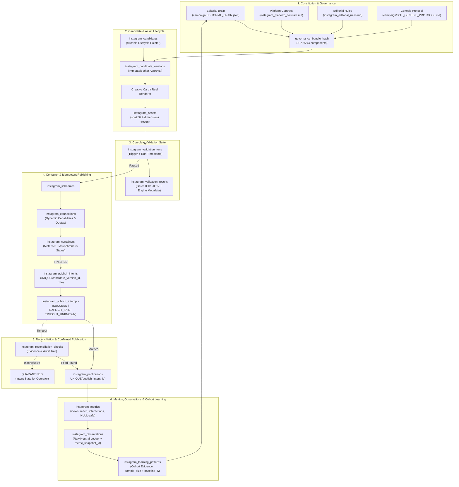

# WritOn Instagram Automation Bot Suite — Architecture & AI Operations Manual

> **Document Type**: Architecture & AI Operations Manual (`INSTAGRAM_BOTS.md`)  
> **Subsystem**: WritOn Multi-Channel Autonomous Ecosystem • Instagram Bot Fleet  
> **Status**: Production-Hardened • Meta Graph API `v26.0` Ready

---

## 1. Executive Summary & Philosophy

The WritOn Instagram Bot Suite is an enterprise-grade, Brain-governed autonomous publishing and intelligence system. It does not treat social media as an ephemeral fire-and-forget script, but as an auditable, provenance-backed pipeline:
1. **Brain Governed**: Every candidate is linked to a Master Editorial Brain insight (`campaign/EDITORIAL_BRAIN.json`) and validated against 17 visual and content gates.
2. **PostgreSQL as Authoritative State**: Exactly 15 tables manage the state of connections, candidate revisions, versioned assets, validation runs, asynchronous Meta containers, publish intents, reconciliation, publications, metrics, and cohort learning.
3. **Idempotency & Reconciliation**: The single publication intent is the boundary. Network timeouts enter `reconciliation_pending` and `QUARANTINED` states—never blind duplicate retries.

---

## 2. Complete End-to-End Architecture



---

## 3. Database Schema Reference (15 Tables)

1. `instagram_connections`: Connected accounts, auth provider (`FACEBOOK_LOGIN` vs `INSTAGRAM_LOGIN`), token expiry, and dynamic capabilities.
2. `instagram_candidates`: Mutable top-level candidate lifecycle pointer.
3. `instagram_candidate_versions`: Immutable candidate revision containing caption, visual spec, content hash, asset manifest hash, and governance bundle hash.
4. `instagram_assets`: Media files (JPEG, MP4) with SHA-256 and dimensions frozen upon approval, and rotatable signed public URLs.
5. `instagram_validation_runs`: Complete validation run execution event and trigger metadata.
6. `instagram_validation_results`: Detailed evaluation of each of the 17 gates (`IG01`–`IG17`) with versioned repetition engine metadata.
7. `instagram_schedules`: Publishing time windows and queue management.
8. `instagram_containers`: Asynchronous Meta Graph API v26.0 containers (`CHILD`, `PARENT`, `SINGLE`) mapped directly to slide assets.
9. `instagram_publish_intents`: Single logical publication intent with dual-layer database uniqueness (`publish_key` and `(candidate_version_id, publication_role)`).
10. `instagram_publish_attempts`: Execution attempts under an intent, recording `SUCCESS`, `EXPLICIT_FAIL`, or `TIMEOUT_UNKNOWN`.
11. `instagram_reconciliation_checks`: Auditable history of post-timeout feed lookups and evidence before quarantine.
12. `instagram_publications`: Confirmed live Instagram media with permalink, shortcode, and immutable provenance.
13. `instagram_metrics`: Views-centric engagement snapshots (views, reach, likes, comments, saved, shares, total interactions).
14. `instagram_observations`: Raw, neutral observation ledger with metric lineage (`metric_snapshot_id`) and preserved nullability.
15. `instagram_learning_patterns`: Aggregate cohort performance evidence across archetypes, hook structures, and slide counts.

---

## 4. Operational Commands & CLI Agents

### 4.1 CLI Publisher Agent (`scripts/instagram_publisher.mjs`)
```powershell
# Dry run a candidate version through validation and capability checks
node scripts/instagram_publisher.mjs --candidate-version-id=<UUID> --dry-run

# Publish candidate version within scheduled window
node scripts/instagram_publisher.mjs --candidate-version-id=<UUID>

# Ignore schedule window (surgical override for emergency hotfixes)
node scripts/instagram_publisher.mjs --candidate-version-id=<UUID> --ignore-schedule-window

# Regenerate expired containers before publishing
node scripts/instagram_publisher.mjs --candidate-version-id=<UUID> --regenerate-container
```

### 4.2 CLI Intelligence Scout Agent (`scripts/instagram_scout.mjs`)
```powershell
# Harvest metrics for recent posts, snapshot to instagram_metrics, and update observations
node scripts/instagram_scout.mjs --harvest-window=24h

# Analyze cohort performance patterns and generate candidate learning entries
node scripts/instagram_scout.mjs --analyze-cohorts --min-sample=5
```

---

## 5. UI Architecture: The Shared Instagram Studio

Both `public/instagram.html` (the standalone focused workspace) and `public/canvas.html` (under tab `📸 Instagram Studio & Tracker`) mount the exact same unified component:
- `public/js/instagram-studio.js`
- `public/css/instagram-studio.css`

Features:
- **3-Gauge Health Display**: Meta Graph API v26.0 latency, dynamic `content_publishing_limit` quota gauge, and token expiry countdown.
- **Visual Carousel Deck Inspector**: 10-slide visual sequence inspector with narrative role badges (`Hook`, `Tension`, `Proof`, `CTA`), 0:00 proposition check, and 125-char fold guide.
- **Story Studio**: 9:16 vertical view with clear `MANUAL FINISH REQUIRED` interactive sticker guidance.
- **Container & Reconciliation Watcher**: Real-time status polling monitor with one-click reconciliation and quarantine review.
- **Views-First Performance Analytics**: Deep metrics charts with export capabilities.
