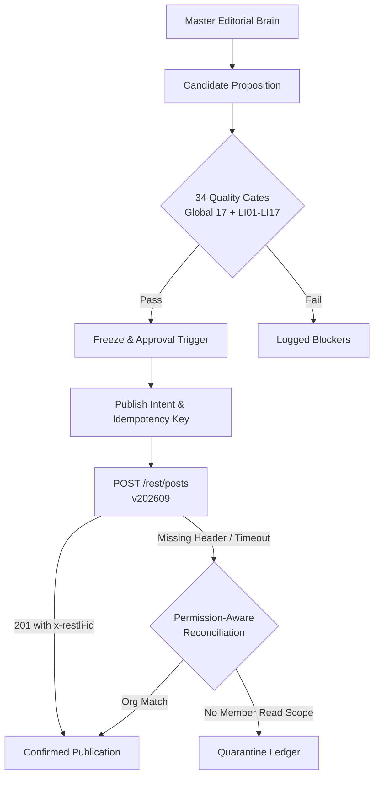

# LinkedIn Autonomous Bot Suite (`LINKEDIN_BOTS.md`)

> **Brain-Governed Architectural Reference for WritOn LinkedIn Automation**

---

## 1. Subsystem Architecture

The WritOn LinkedIn Bot Suite is governed by the Master Editorial Brain (`campaign/EDITORIAL_BRAIN.json`) and implemented as a zero-dependency, pure-`fetch` state machine backed by 15 PostgreSQL tables:



---

## 2. Dedicated LinkedIn Studio Interface

The dedicated studio interface is available locally at:
- `public/linkedin.html`
- Route: `/linkedin-studio` (and `/linkedin.html`)

### Core Capabilities:
1. **24-Hour Quota Meters**: Visual gauges tracking estimated application calls (500 limit) and member calls (100 limit).
2. **Brain Insight Integrator**: Generates candidates with 0:00 cut hooks and craft proof from editorial insights.
3. **Quality Gate Drawer**: Live traffic-light evaluation for gates `LI01` through `LI17`.
4. **Quarantine Ledger**: Resolves ambiguous publishes without blind retry duplication.
5. **Multi-Surface Telemetry**: Displays impression, reaction, and share performance across member and organization surfaces.

---

## 3. Key Commands & Execution

### Brain Publisher (Dry Run):
```bash
node scripts/linkedin_publisher.mjs --brain --dry-run
```

### Telemetry Scout & Quarantine Audit:
```bash
node scripts/linkedin_scout.mjs --dry-run
node scripts/linkedin_scout.mjs --harvest-window=24h --json
```

---

## 4. Operational Invariant

- **NEVER POST TEST THINGS ONLINE**: Live dispatch requires explicit operator authorization and non-test editorial assets.
