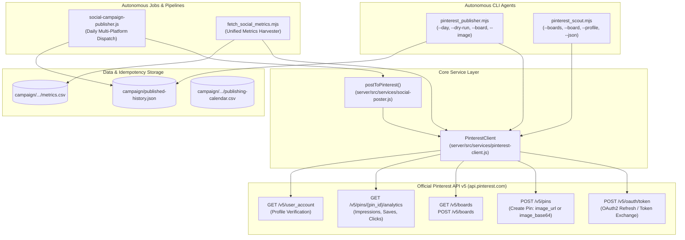

# WritOn Pinterest Automation Bot Suite — Architecture & AI Operations Manual

> **Purpose for AI Agents (Codex, Claude, Gemini, Cursor, Copilot)**:  
> This document is the single source of truth for understanding, modifying, and upgrading the Pinterest automation bots and multi-agent pipeline in the **WritOn 2.0** repository. When asked to inspect, debug, modify, or extend Pinterest functionality, read this document first.

---

## 1. System Architecture Overview

The Pinterest Automation Suite integrates into WritOn's multi-platform editorial publishing engine. It leverages Pinterest as an evergreen visual search discovery channel, indexing WritOn's Warm Parchment watercolor quote cards and writing prompts with long shelf-lives (6+ months).



---

## 2. File & Component Registry

| File Path | Role & Description | Primary Exports / Functions |
| :--- | :--- | :--- |
| [`server/src/services/pinterest-client.js`](file:///d:/VibeCode/WritOn-PowerUp/server/src/services/pinterest-client.js) | Core Pinterest API v5 client handling Bearer tokens, token refresh, rate limits, board operations, Pin creation (URL + Base64), and analytics. | `class PinterestClient` (`getAccessToken`, `request`, `getMe`, `getBoards`, `createBoard`, `createPin`, `getPin`, `getPinAnalytics`) |
| [`server/src/services/social-poster.js`](file:///d:/VibeCode/WritOn-PowerUp/server/src/services/social-poster.js) | Universal multi-platform publisher interface (X, Instagram, Threads, Telegram, Reddit, Pinterest). | `postToPinterest(options)` |
| [`server/src/jobs/social-campaign-publisher.js`](file:///d:/VibeCode/WritOn-PowerUp/server/src/jobs/social-campaign-publisher.js) | Autonomous daily multi-platform publishing orchestrator. Step 7 publishes to Pinterest and persists `results.pinterestPinId`. | `runDailyCampaignPublish(options)` |
| [`scripts/pinterest_publisher.mjs`](file:///d:/VibeCode/WritOn-PowerUp/scripts/pinterest_publisher.mjs) | Standalone CLI publishing agent for manual dispatch, custom pins, campaign day loading, and dry-runs. | Executable script (`--day`, `--board`, `--title`, `--description`, `--link`, `--image`, `--dry-run`) |
| [`scripts/pinterest_scout.mjs`](file:///d:/VibeCode/WritOn-PowerUp/scripts/pinterest_scout.mjs) | Community intelligence agent to inspect boards, profile details, and existing pins. | Executable script (`--boards`, `--board`, `--profile`, `--limit`, `--json`) |
| [`scripts/fetch_social_metrics.mjs`](file:///d:/VibeCode/WritOn-PowerUp/scripts/fetch_social_metrics.mjs) | Social metric collection engine aggregating views (impressions), saves (likes), and outbound clicks across platforms. | `fetchPinterestMetrics(postTarget)` |
| [`server/test/pinterest-client.test.js`](file:///d:/VibeCode/WritOn-PowerUp/server/test/pinterest-client.test.js) | Vitest unit test suite validating token exchange, 401 token refresh retry, 429 backoff, Pin creation (URL & Base64), error categorization, and metrics parsing. | 10 passing Vitest unit tests |
| [`rules_pinterest.md`](file:///d:/VibeCode/WritOn-PowerUp/rules_pinterest.md) | Official Pinterest API operational standards, Bearer token lifecycle, rate limit budgets, and anti-spam compliance rules. | Specifications reference |
| [`pinterest_api_reference.md`](file:///d:/VibeCode/WritOn-PowerUp/pinterest_api_reference.md) | Exhaustive directory of Pinterest API v5 endpoints, schemas, parameters, and payloads. | API reference catalogue |

---

## 3. Environment Variables Configuration

Credentials must be placed in `server/.env`:

```ini
# Pinterest API v5 Credentials (from https://developers.pinterest.com/apps/)
PINTEREST_APP_ID=your_app_id
PINTEREST_APP_SECRET=your_app_secret
PINTEREST_ACCESS_TOKEN=pina_your_bearer_access_token
PINTEREST_REFRESH_TOKEN=pinr_your_refresh_token_if_applicable

# Default Board ID for WritOn Craft & Prompts
PINTEREST_DEFAULT_BOARD_ID=your_board_id_here
```

---

## 4. Key Architectural Patterns & Guardrails

### 4.1 Native Zero-Dependency Architecture (Dietrich Gebert's Ponytail Principle)
- Uses native Node.js `fetch`, `URLSearchParams`, and `fs/promises`.
- Never install bloated third-party wrappers or Axios.
- Local cards are directly read into memory and encoded as `image_base64` payloads (`content_type: image/png`).

### 4.2 Field Ceilings & Copywriting Governance
- **Title**: Automatically truncated at **100 characters** to prevent silent Pinterest rejection.
- **Description**: Automatically truncated at **800 characters**. Must contain high-intent writing and reading search terms for algorithmic visual search.
- **Alt Text**: Clamped to **500 characters** for accessibility (WCAG AA).
- **Aesthetic**: All pins feature WritOn's official Warm Ivory Parchment (`#FAF5EE`) aesthetic with terracotta watercolor blooms (`#D45226`). Strictly zero obsidian dark cards.

### 4.3 Resilience Standards
- **Token Cache**: Tokens are cached in-memory with a 60-second safety window.
- **Auto-401 Retry**: If an access token expires mid-flight and refresh credentials exist, `request()` clears the cache, acquires a fresh token, and retries once automatically.
- **Adaptive 429 Backoff**: Parses `Retry-After` or `X-RateLimit-Reset` headers, sleeps, and retries up to 3 times before failing.

---

## 5. CLI Execution Guide

### Publishing

```bash
# Publish YouTube Shorts or video directly to Pinterest
node scripts/pinterest_publisher.mjs \
  --youtube="https://www.youtube.com/shorts/uAofGjWLQjg" \
  --title="Don't Start With Weather: How to Open a Scene" \
  --desc="A scene begins with a consequence, not ambient temperature. Watch the full craft breakdown." \
  --board="1084171378986901351"

# Dry-run publish a YouTube video
node scripts/pinterest_publisher.mjs --youtube="-FRnucIMFck" --title="Writing Hack: Delete Your Favourite Adjective" --dry-run

# Dry-run publish Day 1 campaign payload
node scripts/pinterest_publisher.mjs --day=1 --dry-run

# Live publish custom card
node scripts/pinterest_publisher.mjs \
  --title="How to Write Compelling Pacing" \
  --description="Pacing is controlled by sentence length, white space, and scene momentum." \
  --image="campaign/fomo-ground-floor/rendered-assets/day1_slide_1.png" \
  --board="1084171378986901351"
```

> **Story vs. YouTube Publishing Policy**:
> - **Stories**: Fully managed and auto-published via WritOn's dedicated public RSS feed (`https://writon.cc/pinterest-feed.xml`). Story publish endpoints bypass direct automated API pinning to avoid duplicate pins and velocity spam blocks.
> - **YouTube Videos & Shorts**: Published manually via `node scripts/pinterest_publisher.mjs --youtube="..."`, pairing rich YouTube video links with cover frames or HD thumbnails.

### Intelligence Scouting
```bash
# List all boards on account
node scripts/pinterest_scout.mjs --boards

# Output JSON for pipeline consumption
node scripts/pinterest_scout.mjs --boards --json

# View profile status
node scripts/pinterest_scout.mjs --profile
```

### Automated Testing
```bash
# Run Pinterest unit test suite
npx vitest run test/pinterest-client.test.js
```

---

## 6. Update Ledger & History

- **2026-09-12 (v2.0.66)**: Initial creation of the Pinterest Autonomous Bot Suite following the official WritOn Bot Genesis Protocol. Verified 10 unit tests in `server/test/pinterest-client.test.js` passing.
