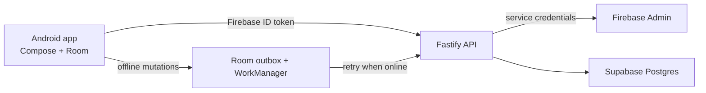

# WritOn 2.0

WritOn is an Android-first editorial publishing app. The active production path is a Kotlin/Jetpack Compose client backed by a Fastify API and Supabase Postgres.

- **Primary Working Repository (Origin)**: [`Saurabh682/WritOn-PowerUp`](https://github.com/Saurabh682/WritOn-PowerUp.git)
- **Upstream Repository**: [`Saurabh682/Writon-2.0`](https://github.com/Saurabh682/Writon-2.0.git)
- **Active Working Branch**: `Till_29Aug` *(synchronized with `production` and `main`)*

## Active architecture




- Active server entry point: `server/src/server.js`
- Active database: Supabase Postgres
- Authentication: Firebase Authentication ID tokens verified by Firebase Admin
- Offline writes: Room outbox retried by WorkManager

`server/src/index.ts`, `server/src/routes/`, and the SQLite/Drizzle files are legacy code retained for migration reference. They are not the deployment entry point.

## Run the API locally

```powershell
cd server
Copy-Item .env.example .env
npm install
npm run dev
Invoke-RestMethod http://localhost:3001/health
```

Set these values in `server/.env` locally, or in your host's encrypted environment-variable settings when deploying:

- `DATABASE_URL` — Supabase Postgres connection string
- `FIREBASE_SERVICE_ACCOUNT_JSON` — one-line Firebase service-account JSON
- `CORS_ORIGINS` — comma-separated HTTPS origins in production

Never commit `.env`, Firebase JSON, a database URL, or Android signing keys.

## Deploy the API to Render

`render.yaml` deploys the Docker-based Fastify service from `server/Dockerfile`, exposes the `/health` check, and keeps credentials out of Git.

1. Push these changes to GitHub.
2. In Render, select **New → Blueprint**, connect the WritOn repository, then select `render.yaml`.
3. Provide the three prompted secrets:
   - `DATABASE_URL`: the Supabase Postgres connection URI.
   - `FIREBASE_SERVICE_ACCOUNT_JSON`: minified contents of the Firebase Admin service-account JSON.
   - `CORS_ORIGINS`: the exact HTTPS web origin, such as `https://writon.example`. Use a temporary HTTPS placeholder if the Android app is the only client for now.
4. After the deploy is healthy, copy the generated `https://…onrender.com` URL into `WRITON_RELEASE_API_BASE_URL`.

Render Blueprints support Docker build contexts, health-check paths, and dashboard-supplied `sync: false` secrets; the generated service URL is public HTTPS. [Render Blueprint reference](https://render.com/docs/blueprint-spec)

## Android API configuration

Copy `gradle.properties.example` to either the project `gradle.properties` or your user Gradle properties, then set the appropriate endpoint:

```properties
# Emulator debug build
WRITON_DEBUG_API_BASE_URL=http://10.0.2.2:3001/

# Physical device debug build (your computer's LAN address)
# WRITON_DEBUG_API_BASE_URL=http://192.168.x.x:3001/

# Release builds must use a real HTTPS API host.
WRITON_RELEASE_API_BASE_URL=https://api.your-domain.example/
```

Debug permits HTTP for local development. Release builds permit HTTPS only and redact authorization tokens from logs.

## Android release signing

Copy `keystore.properties.example` to the ignored `keystore.properties` and provide a newly generated upload key. The former tracked upload key has been removed from Git tracking; rotate it in Google Play Console before any production release.

## API surface

| Method | Endpoint | Requires a Firebase token |
| --- | --- | --- |
| `GET` | `/health` | No |
| `GET`, `PUT` | `/api/v1/me` | Yes |
| `GET`, `POST` | `/api/v1/posts` | GET no, POST yes |
| `GET` | `/api/v1/posts/:idOrSlug` | No |
| `POST` | `/api/v1/posts/:id/like` | Yes |
| `POST` | `/api/v1/posts/:id/bookmark` | Yes |
| `GET`, `POST` | `/api/v1/comments/:postId` | GET no, POST yes |
| `GET` | `/api/v1/users/:idOrPenName` | No |
| `POST` | `/api/v1/users/:id/follow` | Yes |

## Verification

```powershell
cd server
npm run build
npm test                 # Fastify API contract tests
npm run test:legacy      # optional Hono/SQLite migration-reference tests
Invoke-RestMethod http://localhost:3001/health
```

Add broader authenticated Fastify integration coverage before a public release.

## Key Features & Capabilities (v2.0.0)

- **Internationalization (i18n)**: In-app language switching with support for English, Hindi (हिन्दी), Spanish (Español), French (Français), Bengali (বাংলা), and Marathi (मराठी).
- **Biometric Security**: Native Fingerprint & Face ID App Lock protection.
- **Modern Jetpack Compose UI**: Dynamic `MaterialTheme` color palette across Paper, Sepia, Dark Obsidian, and System themes.
- **Offline-First Reading & Writing**: Room database caching with WorkManager outbox background sync.
- **Illustrated Editorial Covers**: Automatic rendering of vintage illustrated book covers for stories.
- **Google Play Compliance**: Full compliance with Child Safety Standards ([`CHILD_SAFETY_STANDARDS.md`](CHILD_SAFETY_STANDARDS.md)) and Data Safety Account Deletion policies ([`ACCOUNT_DELETION.md`](ACCOUNT_DELETION.md)).

For a detailed history of all changes, see [`CHANGELOG.md`](CHANGELOG.md).

