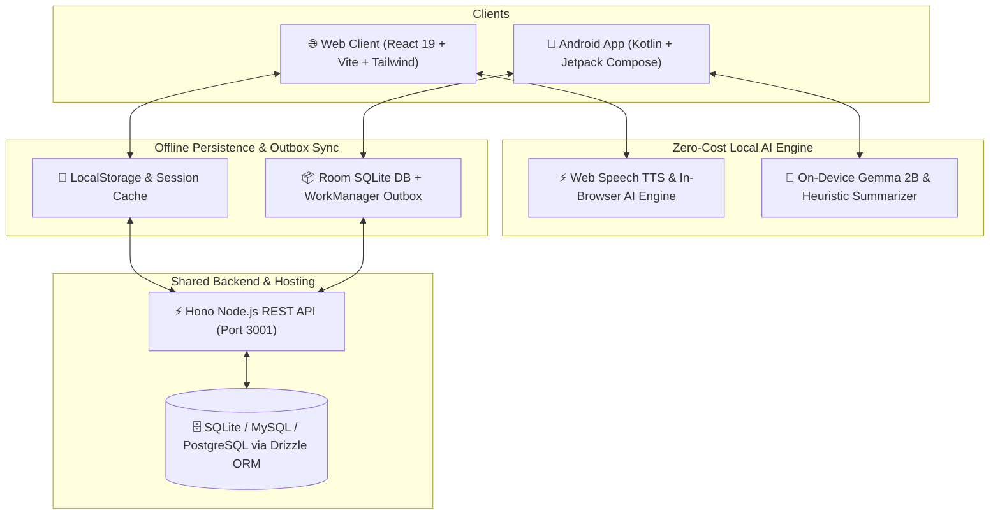

# 🖋️ WritOn 2.0 — Modern Full-Stack Publishing Platform

> A multi-platform publishing platform (Web + Android + High-Performance Backend) sharing a unified database, offline outbox synchronization, and a **zero-cloud-cost on-device/in-browser AI engine**.

---

## 🏛️ System Architecture



---

## 📦 Project Structure

```text
WritOn-PowerUp/
├── server/                         # High-Performance Node.js / Hono Backend
│   ├── src/
│   │   ├── auth/                   # JWT & Bcrypt password utils
│   │   ├── db/                     # Drizzle ORM schema, SQLite db, seed script
│   │   ├── routes/                 # auth, posts, comments, users, media
│   │   └── index.ts                # Server entry point
│   ├── test/                       # Vitest integration test suite
│   └── Dockerfile                  # Multi-stage production container
│
├── web/                            # Modern Editorial Web Application
│   ├── src/
│   │   ├── components/             # FeedView, StoryReader, StoryEditor, AuthorProfile, AuthModal
│   │   ├── context/                # AuthContext (JWT session management)
│   │   ├── lib/                    # API client, Zero-Cost Client AI Engine, Web Speech Audio
│   │   └── types.ts                # Domain types & interfaces
│   └── Dockerfile                  # Production Nginx container
│
├── app/                            # Modern Native Android Application
│   └── src/main/java/.../modern/
│       ├── core/designsystem/      # Compose Editorial Theme, Typography, Colors
│       ├── core/network/           # Retrofit 2 + OkHttp + JWT AuthInterceptor
│       ├── core/database/          # AndroidX Room DB (Post, User, OutboxMutation entities)
│       ├── core/ai/                # On-Device Gemma 2B AI Engine interface
│       ├── data/repository/        # Offline-first PostRepository with Kotlin Flow
│       ├── data/sync/              # AndroidX WorkManager OutboxSyncWorker
│       ├── feature/                # Compose FeedScreen, ReaderScreen, EditorScreen, ProfileScreen
│       └── WritOnModernActivity.kt # Compose Navigation Host
│
├── docker-compose.yml              # 1-Click Containerized Full-Stack Deployment
└── ecosystem.config.cjs            # PM2 Cluster Config for VPS / cPanel hosting
```

---

## ⚡ Quickstart

### 1. Run the Backend API (`server/`)
```bash
cd server
npm install
npm run db:seed     # Seeds initial realistic authors, stories, comments, likes
npm run dev         # Launches Hono API on http://localhost:3001
```

Run test suite:
```bash
npm test            # Runs Vitest test suite (11/11 tests passing)
```

### 2. Run the Web Application (`web/`)
```bash
cd web
npm install
npm run dev         # Launches Vite dev server on http://localhost:3000
```

### 3. Run with Docker Compose
```bash
docker compose up --build
```

---

## 📡 REST API Reference

| Method | Endpoint | Description | Auth Required |
| :--- | :--- | :--- | :--- |
| `POST` | `/api/v1/auth/register` | Register new user & issue JWT | No |
| `POST` | `/api/v1/auth/login` | Login user & issue JWT | No |
| `GET` | `/api/v1/auth/me` | Current authenticated user profile | Yes |
| `GET` | `/api/v1/posts` | Paginated stories (`?category=x&tab=latest\|trending\|following&q=search`) | Optional |
| `GET` | `/api/v1/posts/:id_or_slug` | Story details + interaction state | Optional |
| `POST` | `/api/v1/posts` | Publish new story | Yes |
| `PUT` | `/api/v1/posts/:id` | Update story | Yes |
| `DELETE` | `/api/v1/posts/:id` | Delete story | Yes |
| `POST` | `/api/v1/posts/:id/like` | Toggle applause / like | Yes |
| `POST` | `/api/v1/posts/:id/bookmark`| Toggle bookmark | Yes |
| `GET` | `/api/v1/comments/:postId` | Fetch threaded comments tree | No |
| `POST` | `/api/v1/comments/:postId` | Add comment or nested reply | Yes |
| `GET` | `/api/v1/users/:id_or_penName` | Fetch author profile & metrics | Optional |
| `POST` | `/api/v1/users/:id/follow` | Toggle follow / unfollow | Yes |
| `POST` | `/api/v1/media/upload` | Multipart image upload | Yes |

---

## 🧠 Zero-Cost Local AI Engine Capabilities

- **Reader AI Insights**: In-browser/on-device automatic TL;DR extraction, 3-bullet core takeaways, and tone classification without sending private story contents to third-party paid APIs.
- **AI Writing Copilot**: On-the-fly syntax tightening, literary tone enrichment, and headline generation.
- **Audio Story Narration**: High-fidelity Web Speech & Android TTS narration with speed rate controls (1.0x, 1.25x, 1.5x).
