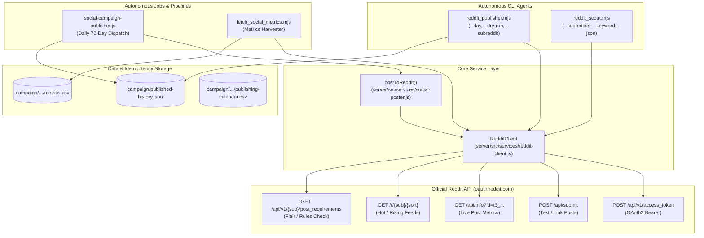

# WritOn Reddit Automation Bot Suite — Architecture & AI Operations Manual

> **Purpose for AI Agents (Codex, Claude, Gemini, Cursor, Copilot)**:  
> This document is the single source of truth for understanding, modifying, and upgrading the Reddit automation bots and multi-agent pipeline in the **WritOn 2.0** repository. When asked to inspect, debug, modify, or extend Reddit functionality, read this document first.

---

## 1. System Architecture Overview

The Reddit Automation Suite integrates into WritOn's multi-platform editorial publishing engine. It operates both autonomously (via daily campaign dispatch cron jobs and metric harvesters) and on-demand (via standalone CLI agents).



---

## 2. File & Component Registry

| File Path | Role & Description | Primary Exports / Functions |
| :--- | :--- | :--- |
| [`server/src/services/reddit-client.js`](file:///d:/VibeCode/WritOn-PowerUp/server/src/services/reddit-client.js) | Core Reddit API client handling OAuth2 password-grant token lifecycle, rate-limits, and raw endpoints. | `class RedditClient` (`getAccessToken`, `request`, `submitPost`, `getPostMetrics`, `getSubredditFeed`, `getPostRequirements`, `getLinkFlairs`) |
| [`server/src/services/social-poster.js`](file:///d:/VibeCode/WritOn-PowerUp/server/src/services/social-poster.js) | Universal multi-platform publisher interface (X, Instagram, Threads, Telegram, Reddit). | `postToReddit(options)` (~line 744) |
| [`server/src/jobs/social-campaign-publisher.js`](file:///d:/VibeCode/WritOn-PowerUp/server/src/jobs/social-campaign-publisher.js) | Autonomous daily multi-platform publishing orchestrator. Steps 1-9 include rendering, posting to all platforms, and saving idempotency. | `runDailyCampaignPublish(options)` (Step 6 handles Reddit) |
| [`scripts/reddit_publisher.mjs`](file:///d:/VibeCode/WritOn-PowerUp/scripts/reddit_publisher.mjs) | Standalone CLI publishing agent for manual dispatch, custom posts, campaign day loading, and dry-runs. | Executable script (`--day`, `--subreddit`, `--title`, `--body`, `--url`, `--dry-run`) |
| [`scripts/reddit_scout.mjs`](file:///d:/VibeCode/WritOn-PowerUp/scripts/reddit_scout.mjs) | Community intelligence agent to discover writing trends, prompt ideas, and community pain points. | Executable script (`--subreddits`, `--keyword`, `--limit`, `--sort`, `--json`) |
| [`scripts/fetch_social_metrics.mjs`](file:///d:/VibeCode/WritOn-PowerUp/scripts/fetch_social_metrics.mjs) | Social metric collection engine aggregating views, upvotes, and comments across all platforms. | `fetchRedditMetrics(postTarget)` |
| [`server/test/reddit-client.test.js`](file:///d:/VibeCode/WritOn-PowerUp/server/test/reddit-client.test.js) | Vitest unit test suite validating authentication, token refresh, rate limiting, post submission, error categorization, and metric parsing. | 8 passing Vitest unit tests |
| [`rules.md`](file:///d:/VibeCode/WritOn-PowerUp/rules.md) | Official Reddit API operational standards, User-Agent formatting, rate limit budgets, and anti-spam compliance rules. | Specifications reference |
| [`reddit_api_reference.md`](file:///d:/VibeCode/WritOn-PowerUp/reddit_api_reference.md) | Exhaustive directory of all 19 Reddit API categories, endpoints, scopes, and parameters. | API reference catalogue |

---

## 3. Environment Variables Configuration

Credentials must be placed in `server/.env` (or standard environment):

```ini
# Reddit Script Application Credentials (from https://www.reddit.com/prefs/apps)
REDDIT_CLIENT_ID=your_script_app_client_id
REDDIT_CLIENT_SECRET=your_script_app_client_secret
REDDIT_USERNAME=your_reddit_username
REDDIT_PASSWORD=your_reddit_account_password

# Required User-Agent: <platform>:<app ID>:<version> (by /u/<reddit_username>)
REDDIT_USER_AGENT=web:writon-publisher:v2.0.0 (by /u/writon_official)

# Default subreddit fallback if not explicitly provided
REDDIT_DEFAULT_SUBREDDIT=writon
```

---

## 4. Key Architectural Patterns & Guardrails

### A. OAuth2 Password-Grant Lifecycle & 401 Recovery
1. **Token Caching**: Tokens are cached in memory (`this.token`) with expiration timestamp (`this.tokenExpiresAt`). A 60-second safety margin is subtracted before expiring so requests never send an expired token.
2. **Auto-Renewal on 401**: If Reddit returns `401 Unauthorized` during `request()`, the cached token is immediately invalidated (`this.token = null`), a new token is requested, and the original call is retried once.
3. **Categorized Errors**: API errors throw an `Error` instance with `err.status` (HTTP status) and `err.path` (endpoint path) attached.

### B. Rate Limit Tracking & Exponential Backoff
- On every response from `oauth.reddit.com`, headers are captured:
  - `x-ratelimit-remaining` (remaining request allowance in 10-minute window)
  - `x-ratelimit-reset` (seconds until allowance resets)
  - `x-ratelimit-used` (requests consumed in current window)
- On **HTTP 429 Too Many Requests**, the client sleeps for `retry-after` (or `resetSeconds`) + 1 second, then retries up to 3 times before failing.

### C. Content Formatting & Platform Sanitization
- **Hashtag Stripping**: In `submitPost()`, Twitter-style hashtags (`#word`) are stripped and excess whitespace collapsed. Reddit does not use hashtags, and multi-platform promotional hashtags look out-of-place and trigger community moderation.
- **Title Character Limits**: Reddit titles are capped at 300 characters via `title.slice(0, 300)`.
- **Pre-Flight Flair Checks**: Before submitting, `getPostRequirements(subreddit)` checks if link flairs are mandatory (`is_flair_required`). If required and none provided by caller, `getLinkFlairs(subreddit)` retrieves available flairs and attaches the first valid flair ID and text.

### D. Idempotency & Analytics Persistence
- Submissions record the Reddit fullname (`t3_<id36>`) and permalink to `campaign/published-history.json` under `history.reddit[subreddit]`.
- `social-campaign-publisher.js` persists `results.redditFullname` for the campaign day.
- `fetch_social_metrics.mjs` reads the saved fullname, calls `getPostMetrics()`, and writes `{ views, likes, comments, upvote_ratio }` to `metrics.csv`.

---

## 5. Developer & AI CLI Operations

### Run Dry-Run Campaign Post
```bash
node scripts/reddit_publisher.mjs --day=1 --dry-run
```

### Publish Custom Post
```bash
node scripts/reddit_publisher.mjs --subreddit=writon --title="Crafting Deep Prose" --body="Words should breathe."
```

### Publish Link Post
```bash
node scripts/reddit_publisher.mjs --subreddit=writon --title="WritOn 2.0 Launch" --url="https://writon.cc" --kind=link
```

### Run Community Trend Scout
```bash
# Scan default subreddits (r/writing, r/writingprompts, r/selfpublish)
node scripts/reddit_scout.mjs --limit=10

# Scan specific subreddits with keyword search in JSON format
node scripts/reddit_scout.mjs --subreddits=writing,screenwriting --keyword=dialogue --json
```

### Run Unit Tests
```bash
cd server
npx vitest run test/reddit-client.test.js
```

---

## 6. How to Extend / Upgrade This Suite (Guide for Future AIs)

When implementing new capabilities, follow these rules:

### 1. Adding Native Image / Media Uploads (`kind: 'image'`)
- Consult [`reddit_api_reference.md`](file:///d:/VibeCode/WritOn-PowerUp/reddit_api_reference.md#10-media-uploads--galleries) (Section 10).
- Reddit media uploads require a 2-step process:
  1. `POST /api/media/asset.json` to request S3 upload lease and get `asset_id` + upload URL.
  2. Upload file buffer to S3 using returned credentials.
  3. Call `POST /api/submit` with `kind: 'image'` and `url` set to the S3 asset URL.

### 2. Adding Comment Engagement / Auto-Responder Bot
- Use `POST /api/comment` (`parent`: fullname e.g. `t3_...` for post or `t1_...` for comment, `text`: markdown reply).
- To read incoming replies: `GET /message/inbox` or `GET /message/unread`.
- Remember to mark read with `POST /api/read_message` (`id`: comma-separated fullnames).

### 3. Adding Subreddit Modqueue / Moderation
- See Section 14 in [`reddit_api_reference.md`](file:///d:/VibeCode/WritOn-PowerUp/reddit_api_reference.md#14-moderation-tools).
- Use `POST /api/approve` and `POST /api/remove` with OAuth scope `modposts`.

### 4. Code Minimization Rule (Ponytail Principle)
- Do not introduce external libraries (e.g. Snoowrap, snoots, snoo2). The lightweight native `fetch`-based `RedditClient` is intentionally zero-dependency (native Node.js `fetch` + `URLSearchParams`).
- Keep all new endpoints inside `RedditClient` following the pattern: `async myMethod(...) { return this.request('/api/...', { method: 'POST', body: ... }); }`.

---

## 7. Chronological Update Ledger

### Version 2.0.65 (2026-09-12) — Suite Hardening & History Integration
- **401 Invalidation & Retry**: Added token invalidation and single fresh token retry in `RedditClient.request()` when HTTP 401 is encountered.
- **Categorized Errors**: Errors now carry `err.status` and `err.path`.
- **Hashtag Stripping**: Added regex `#\w+` removal in `RedditClient.submitPost()` and removed redundant hashtags from `reddit_publisher.mjs`.
- **History Storage**: Added persistent recording of post fullname and URL in `campaign/published-history.json` across both `reddit_publisher.mjs` and `social-campaign-publisher.js`.
- **Scout JSON & Keywords**: Added `--json` output flag and `--keyword` filtering in `reddit_scout.mjs`.
- **Static Import Optimization**: Refactored `fetch_social_metrics.mjs` to import `RedditClient` statically.
- **Unit Tests**: Expanded test suite to 9 tests in `server/test/reddit-client.test.js` (100% pass).
- **Data API Support Ticket**: Submitted official API Access Request to Reddit Support (`support@reddit.zendesk.com`) on 2026-09-12 for `writon_publisher` to lift Responsible Builder Policy restrictions on script app creation.

### Version 2.0.64 (2026-09-12) — Initial Suite Creation
- **Initial Implementation**: Created `RedditClient`, `reddit_publisher.mjs`, `reddit_scout.mjs`, and documentation (`rules.md`, `reddit_api_reference.md`).
- **Initial Integration**: Added `postToReddit` to `social-poster.js` and wired into `social-campaign-publisher.js`.
