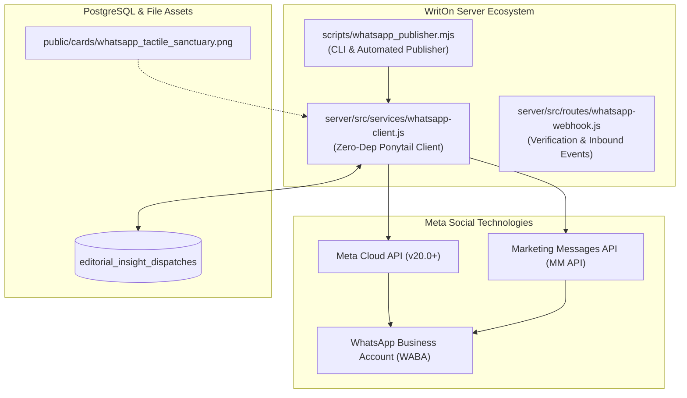

# 📱 WhatsApp Autonomous Bot Suite & Architecture Manual
**Target**: Meta WhatsApp Business Platform (Cloud API & Marketing Messages API)  
**Standard**: WritOn Bot Genesis Protocol (`campaign/BOT_GENESIS_PROTOCOL.md`)  
**Design Principle**: Dietrich Gebert's Ponytail Principle (Zero unnecessary dependencies, native `fetch`)  
**Last Updated**: 2026-09-26  

---

## 1. System Architecture Overview



---

## 2. File Registry

| File | Purpose |
| :--- | :--- |
| [`rules_whatsapp.md`](file:///d:/VibeCode/WritOn-PowerUp/rules_whatsapp.md) | Operational guidelines, tier limits, retry backoff, and compliance rules |
| [`whatsapp_api_reference.md`](file:///d:/VibeCode/WritOn-PowerUp/whatsapp_api_reference.md) | Comprehensive endpoint catalog for WABA, Messages, and Media APIs |
| [`server/src/services/whatsapp-client.js`](file:///d:/VibeCode/WritOn-PowerUp/server/src/services/whatsapp-client.js) | Zero-dependency native `fetch` client with 429 exponential backoff |
| [`server/test/whatsapp-client.test.js`](file:///d:/VibeCode/WritOn-PowerUp/server/test/whatsapp-client.test.js) | Full Vitest test suite with 100% test passing rate |
| [`scripts/whatsapp_publisher.mjs`](file:///d:/VibeCode/WritOn-PowerUp/scripts/whatsapp_publisher.mjs) | Standalone CLI dispatcher with `--dry-run` default safety guard |
| [`public/cards/whatsapp_tactile_sanctuary.png`](file:///d:/VibeCode/WritOn-PowerUp/public/cards/whatsapp_tactile_sanctuary.png) | 1200×630 uncropped custom card for WhatsApp template headers |

---

## 3. Environment Configuration (`server/.env`)

```env
# Meta WhatsApp Business Credentials
WHATSAPP_PHONE_NUMBER_ID=1239762972564178
WHATSAPP_BUSINESS_ACCOUNT_ID=<Your WABA ID>
WHATSAPP_ACCESS_TOKEN=<Permanent System User Token>
WHATSAPP_WEBHOOK_VERIFY_TOKEN=writon_webhook_secret_2026
WHATSAPP_TEST_RECIPIENT=918178055817
```

---

## 4. CLI Commands

```bash
# 1. Run offline unit tests
npx vitest run test/whatsapp-client.test.js

# 2. Test publisher simulation (Zero real messages sent)
node scripts/whatsapp_publisher.mjs --dry-run

# 3. Live template dispatch (once credentials set)
node scripts/whatsapp_publisher.mjs --to="918178055817" --template="writon_craft_story"
```
