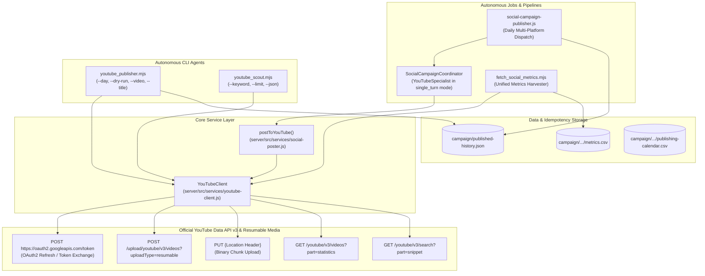

# WritOn YouTube Automation Bot Suite — Architecture & AI Operations Manual

> **Purpose for AI Agents (Codex, Claude, Gemini, Cursor, Copilot)**:  
> This document is the single source of truth for understanding, modifying, and upgrading the YouTube automation bots and multi-agent pipeline in the **WritOn 2.0** repository. When asked to inspect, debug, modify, or extend YouTube functionality, read this document first.
>
> **Live Production Channel**:  
> - **Channel Name**: `WritOn — Calm Reading & Writing`  
> - **Handle**: [`@writon_app`](https://www.youtube.com/@writon_app)  
> - **Primary URL**: `https://www.youtube.com/@writon_app`

---

## 1. System Architecture Overview

The YouTube Automation Suite integrates into WritOn's multi-platform editorial publishing engine. It powers automated publishing of **YouTube Shorts** (vertical 9:16 videos created from craft cards and HyperFrames motion sequences) and tracks engagement (views, likes, comments).



---

## 2. File & Component Registry

| File Path | Role & Purpose |
| :--- | :--- |
| [`rules_youtube.md`](file:///d:/VibeCode/WritOn-PowerUp/rules_youtube.md) | Platform rules, quotas (10,000 units/day ceiling, 1600 units/upload), Shorts standards, **English only**, and **strictly lowercase hashtags** (`#shorts`, `#writon`). |
| [`youtube_api_reference.md`](file:///d:/VibeCode/WritOn-PowerUp/youtube_api_reference.md) | Exhaustive API endpoint reference for Google OAuth2 and YouTube Data API v3. |
| [`server/src/services/youtube-client.js`](file:///d:/VibeCode/WritOn-PowerUp/server/src/services/youtube-client.js) | Zero-dep client with OAuth auto-refresh, resumable upload, automatic hashtag lowercasing, 401 retry, 429 backoff, search. |
| [`server/src/services/social-poster.js`](file:///d:/VibeCode/WritOn-PowerUp/server/src/services/social-poster.js) | Standardized export `postToYouTube({ videoPath, title, description, isShort, config })`. |
| [`server/src/services/social-campaign-coordinator.js`](file:///d:/VibeCode/WritOn-PowerUp/server/src/services/social-campaign-coordinator.js) | `YouTubeSpecialist` collaborative agent integrated into `coordinatePublish()`. |
| [`server/src/jobs/social-campaign-publisher.js`](file:///d:/VibeCode/WritOn-PowerUp/server/src/jobs/social-campaign-publisher.js) | Campaign publishing step, recording `results.youtubeVideoId` into `published-history.json`. |
| [`scripts/youtube_publisher.mjs`](file:///d:/VibeCode/WritOn-PowerUp/scripts/youtube_publisher.mjs) | Standalone CLI agent with `--day`, `--video`, `--title`, and `--dry-run` modes. |
| [`scripts/youtube_scout.mjs`](file:///d:/VibeCode/WritOn-PowerUp/scripts/youtube_scout.mjs) | Community trends and video discovery scout supporting `--keyword`, `--limit`, and `--json`. |
| [`scripts/fetch_social_metrics.mjs`](file:///d:/VibeCode/WritOn-PowerUp/scripts/fetch_social_metrics.mjs) | Harvesting views, likes, and comments from YouTube video IDs into `metrics.csv`. |
| [`server/test/youtube-client.test.js`](file:///d:/VibeCode/WritOn-PowerUp/server/test/youtube-client.test.js) | Vitest test suite with 100% passing rate across auth, upload, retry, and metrics. |

---

## 3. Environment Variables Template (`server/.env`)

```ini
# --- YouTube Automation Suite ---
YOUTUBE_CLIENT_ID=your_oauth_client_id.apps.googleusercontent.com
YOUTUBE_CLIENT_SECRET=your_oauth_client_secret
YOUTUBE_REFRESH_TOKEN=1//your_refresh_token_here
YOUTUBE_ACCESS_TOKEN=temporary_token_optional
YOUTUBE_API_KEY=AIzaSy...your_read_only_key_optional
YOUTUBE_CHANNEL_ID=UC...your_channel_id_optional
```

---

## 4. CLI Execution Recipes

### Dry-Run Verification
```bash
# Check configuration and print planned payload without uploading:
node scripts/youtube_publisher.mjs --day=1 --dry-run
node scripts/youtube_scout.mjs --keyword="literary craft" --dry-run
```

### Manual Video / Shorts Upload
```bash
node scripts/youtube_publisher.mjs --video="./campaign/fomo-ground-floor/rendered-assets/short1.mp4" --title="Three Ways to Begin a Scene" --desc="Notice the small gesture before the speech begins."
```

### Run Vitest Suite
```bash
cd server
npx vitest run test/youtube-client.test.js
```

---

## 5. YouTube Creator Masterclass Protocol (Titles, Discovery & Visual Synergy)

Derived from the YouTube Creators Master Class series (Carina Fragozo):

### 5.1 Titles vs. Tags Priority (Algorithmic Weight & CTR)
- **Titles Overwhelmingly Outweigh Tags**:
  - **The Primary Hook & CTR Gate**: A weak title kills CTR, which stops algorithmic distribution regardless of content quality.
  - **Algorithmic Categorization**: Titles, audio transcripts, descriptions, and video frames are YouTube's primary indexing signals. Titles must balance **searchability** (core topic keywords) with **irresistible curiosity/urgency**.
  - **Tags Are Minimal**: Tags play a negligible role in modern discovery. Do not spend time filling the 500-character tag box. Use tags strictly for common misspellings, abbreviations, or broad anchor terms (`writon`, `writing tips`, `shorts`).

### 5.2 Title & Thumbnail / Opening Frame Synergy
- **Division of Labor (Never Duplicate Text)**:
  - **Thumbnail / 0.0s Hook Frame**: 2 to 4 high-impact, punchy words designed for small mobile screens (e.g., `STOP WRITING / she realized` or `MAKE HER TERRIFYING`).
  - **Video Title**: Delivers the context, intrigue, and searchability that earns the click (e.g., *Stop Writing "She Realized" (Hand Over The Evidence)*).
  - The thumbnail sparks curiosity; the title resolves what the viewer will gain.

### 5.3 Channel Brand Identity & Homepage Curation
- **Consistent Warm Parchment Aesthetic**: Maintain WritOn's signature `#FAF5EE` background, deep charcoal typography, and terracotta accents across channel banner, icon, and video thumbnails.
- **Thematic Playlists**: Organize all published Shorts and long-form videos into targeted craft playlists (*"Show Don't Tell Masterclass"*, *"Dialogue & Restraint"*, *"Opening Lines"*) to maximize binge-watching and session watch time.
- **Immediate Value Clarity**: Channel banner and description must state what the channel offers within 3 seconds of arrival: craft-first literary tools for writers who care about the sentence.
