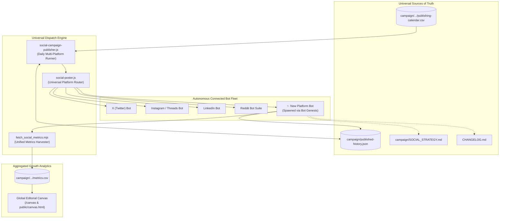

# 🧬 WritOn Bot Genesis Protocol: Autonomous Multi-Platform Bot Factory
**Standard Operating Procedure for Spawning, Hardening, and Evolving Autonomous Bots Across Independent AI Chat Sessions**
*Version: 1.0.0 • Last Updated: 2026-09-12 • Target: WritOn Multi-Channel Autonomous Ecosystem*

> **For All AI Agents (Codex, Claude, Gemini, Cursor, Copilot):**  
> Whenever the user asks to create, integrate, or upgrade an automated bot for **ANY** platform (e.g., Reddit, Telegram, Pinterest, Bluesky, Mastodon, Substack, Medium, Discord, Threads, X, YouTube Community, Hacker News), you MUST execute this exact 7-phase protocol.
>
> **The Golden Rule of the Connected Ecosystem:**  
> New chat sessions operate independently, but they are NEVER isolated. Every chat MUST read from and write to the same single sources of truth:
> 1. [`campaign/SOCIAL_STRATEGY.md`](file:///d:/VibeCode/WritOn-PowerUp/campaign/SOCIAL_STRATEGY.md) *(Master schedule, copy governance, active ticket states, operational findings)*
> 2. [`CHANGELOG.md`](file:///d:/VibeCode/WritOn-PowerUp/CHANGELOG.md) *(Chronological feature & bugfix ledger across all branches)*
> 3. [`campaign/published-history.json`](file:///d:/VibeCode/WritOn-PowerUp/campaign/published-history.json) *(Idempotency ledger preventing duplicate dispatches)*
> 4. [`campaign/antigravity-2026-09-06-19/metrics.csv`](file:///d:/VibeCode/WritOn-PowerUp/campaign/antigravity-2026-09-06-19/metrics.csv) *(Unified cross-platform metrics)*
> 5. [`AGENTS.md`](file:///d:/VibeCode/WritOn-PowerUp/AGENTS.md) *(Global agent instructions and component registry)*

---

## 🗺️ The Autonomous Bot Ecosystem Architecture

Every new bot born from this protocol automatically plugs into WritOn's universal dispatch and intelligence wheel:



---

## 🛠️ The 7-Phase Bot Genesis Process

Whenever a new platform name `{platform}` is requested (e.g. `bluesky`, `telegram`, `pinterest`, `substack`):

```
                       THE 7-PHASE FACTORY PIPELINE
 ┌──────────────┐     ┌──────────────┐     ┌──────────────┐     ┌──────────────┐
 │   PHASE 1    │ ──> │   PHASE 2    │ ──> │   PHASE 3    │ ──> │   PHASE 4    │
 │ Knowledge &  │     │ Zero-Dep     │     │ Multi-Agent  │     │ TDD Suite &  │
 │ Standards    │     │ Core Client  │     │ Integration  │     │ Verification │
 └──────────────┘     └──────────────┘     └──────────────┘     └──────────────┘
                                                                       │
 ┌──────────────┐     ┌──────────────┐     ┌──────────────┐            │
 │   PHASE 7    │ <── │   PHASE 6    │ <── │   PHASE 5    │ <──────────┘
 │ Registration │     │ Strategy &   │     │ Architecture │
 │ Realities    │     │ Changelog    │     │ Manual (MD)  │
 └──────────────┘     └──────────────┘     └──────────────┘
```

---

### Phase 1: Knowledge Ingestion & Standards Extraction
*Goal: Ingest API rules before writing a single line of code.*

1. **Extract Operational Standards** → Create `rules_{platform}.md`:
   - Authentication type (OAuth2 PKCE, Bearer Token, API Key, Basic Auth).
   - User-Agent specification and custom headers.
   - Rate limit budgets (requests per minute/hour, headers to inspect).
   - Anti-spam rules and community content policies.
2. **Catalog All Endpoints** → Create `{platform}_api_reference.md`:
   - Exhaustive catalogue of endpoints, HTTP methods, required scopes, and request/response payloads.

---

### Phase 2: Zero-Dependency Core Client Architecture
*Goal: Build a high-resilience, zero-bloat client adhering to Dietrich Gebert's Ponytail Principle.*

Create `server/src/services/{platform}-client.js`:
- **Zero Heavy SDKs:** Use native Node.js `fetch` and `URLSearchParams`/`FormData`. Never pull heavy third-party wrappers that rot over time.
- **Resilience Standard A (Token Caching & Auto-Renewal):**
  - Cache bearer tokens in memory with a 60-second expiration safety buffer.
  - Implement automatic 401 token invalidation & single retry with a freshly requested token.
- **Resilience Standard B (Adaptive Rate Limit Backoff):**
  - Parse rate limit headers on every response (`X-RateLimit-*` or platform equivalent).
  - Intercept HTTP 429 Too Many Requests, sleep for `retry-after` + 1s, and retry up to 3 times before failing.
- **Resilience Standard C (Content Sanitization):**
  - Strip platform-incompatible elements (e.g. hashtags on Reddit, character truncation on X/Bluesky).
  - Enforce WCAG AA contrast and anti-mannered prose guidelines.
- **Resilience Standard D (Error Categorization):**
  - Throw structured errors carrying `err.status` (HTTP code) and `err.path` (endpoint URI).

---

### Phase 3: Multi-Agent Integration into Universal Engines
*Goal: Wire the new bot into all autonomous publishing, scouting, and tracking pipelines.*

1. **Universal Poster Interface:**
   - In [`server/src/services/social-poster.js`](file:///d:/VibeCode/WritOn-PowerUp/server/src/services/social-poster.js), export `postTo{Platform}(options)`:
     - Handles env var fallback, dry-run safety checks, and returns standardized `{ success, status, postId, url, data }`.
2. **Pre-Dispatch Intent & Governance Protocol (Mandatory):**
   - Derive delivery IDs deterministically from `generateDeliveryId({ campaign, slotId, platform, surface, content })`. Never use non-deterministic `Date.now()` or random UUIDs as delivery keys.
   - Bind delivery ID to cryptographic content hash (`content_hash`); reject reuse if content changes (`DELIVERY_ID_CONTENT_MISMATCH`).
   - Persist reservation and `in_flight` intent in PostgreSQL (`public.editorial_insight_dispatches`) **before** invoking external APIs.
   - Commit the reservation transaction *before* network requests; never hold DB transactions open across remote HTTP calls.
   - Ambiguous network failures (ETIMEDOUT, ECONNRESET, transport drops) transition to `reconciliation_required` and block blind automated retries.
   - Enforce single-surface isolation: never execute unsolicited fan-out across channels.
3. **Daily Campaign Publisher Job:**
   - In [`server/src/jobs/social-campaign-publisher.js`](file:///d:/VibeCode/WritOn-PowerUp/server/src/jobs/social-campaign-publisher.js):
     - Add Step N for `{platform}`.
     - Persist `results.{platform}PostId` into [`campaign/published-history.json`](file:///d:/VibeCode/WritOn-PowerUp/campaign/published-history.json) to guarantee idempotency.
     - Include `{platform}.success` in the idempotency check.
4. **Standalone CLI Publisher Agent:**
   - Create `scripts/{platform}_publisher.mjs`:
     - CLI flags: `--day=N`, `--dry-run`, `--title`, `--body`, `--url`.
     - Automatically saves successful dispatches to `published-history.json`.
     - Wire into `EditorialDispatchCoordinator` with `--dry-run` default (zero test posts online).
5. **Community Intelligence Scout Agent:**
   - Create `scripts/{platform}_scout.mjs`:
     - CLI flags: `--keyword`, `--limit`, `--sort`, `--json`.
     - Supports `--json` mode so its output can pipe directly into data pipelines or the Global Editorial Canvas.
6. **Unified Metrics Harvester:**
   - In [`scripts/fetch_social_metrics.mjs`](file:///d:/VibeCode/WritOn-PowerUp/scripts/fetch_social_metrics.mjs):
     - Add `fetch{Platform}Metrics(target)`.
     - Upsert `{ views, likes, comments, shares }` directly into [`metrics.csv`](file:///d:/VibeCode/WritOn-PowerUp/campaign/antigravity-2026-09-06-19/metrics.csv).

---

### Phase 4: Rigorous Test-Driven Verification
*Goal: 100% test passing before claiming completion.*

1. **Create Vitest Suite:**
   - Create `server/test/{platform}-client.test.js`.
   - Must cover:
     - Configuration detection (`isConfigured()`).
     - Access token acquisition and caching.
     - 401 token refresh retry.
     - 429 backoff handling.
     - Post submission formatting & response mapping.
     - Metrics parsing.
2. **Run Full Verification:**
   ```bash
   # 1. Run unit test suite
   npx vitest run test/{platform}-client.test.js

   # 2. Run full server test suite to ensure zero regressions
   npm test

   # 3. Verify standalone CLI dry-run
   node scripts/{platform}_publisher.mjs --day=1 --dry-run
   ```

---

### Phase 5: Architecture Manual & AI Operations Guide
*Goal: Provide instant, complete context for any other AI (Codex, Claude, etc.) that opens the repo later.*

1. Create `{PLATFORM}_BOTS.md` in the workspace root following the [`REDDIT_BOTS.md`](file:///d:/VibeCode/WritOn-PowerUp/REDDIT_BOTS.md) standard:
   - Visual Mermaid architecture diagram.
   - Exact file registry with relative and absolute paths.
   - Input/output schemas for all methods.
   - Environment variables template (`server/.env`).
   - CLI execution commands.
   - Step-by-step upgrade guide for future AIs.
   - Chronological update ledger.
2. Link `{PLATFORM}_BOTS.md` directly inside [`AGENTS.md`](file:///d:/VibeCode/WritOn-PowerUp/AGENTS.md).

---

### Phase 6: Continuous Strategy & Changelog Synchronization
*Goal: Ensure the master strategy and release ledger evolve in unison.*

1. **Update [`campaign/SOCIAL_STRATEGY.md`](file:///d:/VibeCode/WritOn-PowerUp/campaign/SOCIAL_STRATEGY.md):**
   - **Section 2 (Schedule):** Assign optimal IST time slot for `{platform}`.
   - **Section 3 (Governance):** Document exact hashtag count, copy structure, and anti-spam rules.
   - **Section 6 (CLI Commands):** Add executable dry-run, publishing, and scouting commands.
   - **Section 7+ (Platform Realities):** Add dedicated subsection detailing API policies, bot account requirements, and active ticket states.
2. **Update [`CHANGELOG.md`](file:///d:/VibeCode/WritOn-PowerUp/CHANGELOG.md):**
   - Increment version (e.g. `2.0.66`).
   - List all new files, capabilities, hardened features, and test results.

---

### Phase 7: Real-World Developer Registration & Account Lifecycle
*Goal: Safely navigate modern platform trust & safety gates.*

When configuring credentials for any modern social platform (Reddit, Meta, X, Pinterest, LinkedIn):
1. **Separation Rule:** Never register personal human developer accounts as the bot. Always create a dedicated automated bot account (e.g., `{brand}_bot` / `writon_{platform}`).
2. **Gmail `+` Alias Standard:** Use `main_email+{platform}_bot@gmail.com` to manage distinct bot accounts without needing separate inboxes.
3. **Handle Asynchronous Approval:** Modern platforms enforce Developer Terms (e.g. Reddit's Responsible Builder Policy, Meta App Review, X Developer Intake).
4. **Ticket Logging:** When a support ticket or intake form is submitted, immediately record the Ticket Subject, Timestamp, and Zendesk/Support URL into [`campaign/SOCIAL_STRATEGY.md`](file:///d:/VibeCode/WritOn-PowerUp/campaign/SOCIAL_STRATEGY.md) under Active Ticket Status.

---

## 📋 Copy-Paste Prompt Template for New Chat Sessions

When opening a new chat session to add a new bot, provide this exact prompt to the AI agent:

```markdown
I want to create an autonomous bot for [PLATFORM_NAME] (e.g. Telegram / Pinterest / Bluesky / Substack).

Follow the official WritOn Bot Genesis Protocol documented in `campaign/BOT_GENESIS_PROTOCOL.md`:
1. Follow the 7-phase process: Knowledge Ingestion, Zero-Dep Core Client, Multi-Agent Integration, Test Suite, Architecture Manual, Strategy Sync, and Registration Guide.
2. Synchronize all changes into `campaign/SOCIAL_STRATEGY.md`, `CHANGELOG.md`, `server/src/services/social-poster.js`, `server/src/jobs/social-campaign-publisher.js`, and `scripts/fetch_social_metrics.mjs`.
3. Adhere to the Ponytail principle (zero unnecessary dependencies, native fetch).
4. Run all unit tests and verify dry-run before completion.
```

---

## 📈 Platform Expansion Roadmap Matrix

| Platform | Recommended Slot | Core API Pattern | Auth Type | Primary Asset Format | Zero-Dep Feasibility | Status |
| :--- | :--- | :--- | :--- | :--- | :--- | :--- |
| **Reddit** | 20:30 IST | REST /api/submit | OAuth2 Script | Markdown Self-Post + Flairs | 100% Native Fetch | ✅ Active (v2.0.65) |
| **Telegram** | 12:30 IST & Instant | Bot API /sendMessage | Bot Token | Rendered Card + APK Link | 100% Native Fetch | 🟡 Ready for Genesis |
| **Pinterest** | 09:00 IST | API v5 /pins | OAuth2 Bearer | 1080×1350 Warm Parchment Card | 100% Native Fetch | ✅ Active (v2.0.66) |
| **Bluesky** | 20:30 IST | AT Protocol /com.atproto | App Password | Text + Facets + Image Embed | 100% Native Fetch | 🟡 Ready for Genesis |
| **Substack / Notes** | 09:00 IST | Webhook / RSS Ingest | API / Session | Long-Form Craft Essay | 100% Native Fetch | 🟡 Ready for Genesis |
| **Discord** | On Publish | Webhook /execute | Webhook Token | Rich Embed + Preview Card | 100% Native Fetch | ✅ Active |
