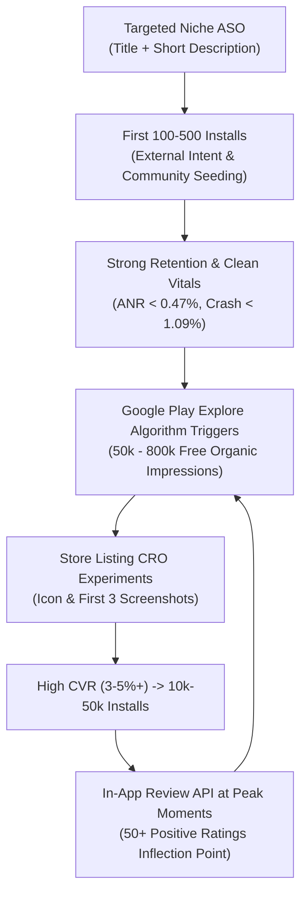

# WritOn Google Play Growth & ASO Playbook

> **Empirical Production Operating Guide**  
> **Source Evidence**: Derived from analyzed Google Play Console acquisition telemetry (`r/googleplayconsole` case study `t3_1wf635x`, 780k Explore impressions boost) and verified milestone post-mortems (10k, 50k, and 100k install indie case studies).

---

## 1. Executive Summary & The Core Discovery Engine

Programmatic and empirical analysis of live Google Play Console data reveals that **over 99% of explosive indie app growth on Android is driven by Google Play Explore** (algorithmic recommendations, "Suggested for you", "Similar apps", and editorial collection tags), NOT paid ads or generic brand search.

---

## 2. Key Empirical Findings from Console Telemetry

### 2.1 The "800k Explore Boost" Telemetry Breakdown
From verified Google Play Console acquisition reports (`t3_1wf635x`):
- **Total Acquisition Traffic**: 780,000 device impressions (+260% surge over 21 days).
- **Channel Distribution**:
  - **Google Play Explore**: **780,000 impressions (99.85% of all traffic)**.
  - **Paid and Direct**: **1,170 impressions (0.15% of all traffic)**.
- **Run-Rate**: Surged to 55,000 impressions/day at peak; settled at a sustained organic baseline of **18,000–20,000 impressions/day**.
- **Conversion Outcome**: 10,000+ installs in month 1; reached initial cashflow profitability ($100 payout threshold) purely from organic acquisition.

### 2.2 The "Paid Ads Trap" vs. Conversion Rate Optimization (CRO)
A common mistake among indie developers is taking initial earnings ($100–$500) and dumping it into Google App Campaigns or Meta Ads.
- **Why Paid Ads Fail at This Stage**: At a baseline of 20,000 free daily impressions, a $100 ad budget buys ~40–80 paid installs—an irrelevant statistical blip.
- **The Highest ROI Lever (Store Listing CRO)**:
  $$\text{At 20,000 daily impressions:}$$
  $$\text{Baseline: } 2\% \text{ Conversion Rate} = 400 \text{ installs/day}$$
  $$\text{Optimized: } 4\% \text{ Conversion Rate} = 800 \text{ installs/day (+12,000 free installs/month)}$$
  **Conclusion**: 100% of creative optimization effort should be directed to the Store Listing itself (icon, first 3 screenshots, and short description) rather than ad networks.

---

## 3. The 6 Empirical Pillars of Google Play Traction

### Pillar 1: Low-Competition Compound Keyword Clusters (The Seed)
- **Indexing Hierarchy**: Google Play indexes:
  1. **App Title**: 30 characters maximum (carries highest keyword weight).
  2. **Short Description**: 80 characters maximum (indexes heavily and sets the pre-install snippet).
  3. **Long Description**: 4,000 characters (natural density of 2–3% for core intent terms).
- **Avoid Saturated Generic Roots**: Ranking #1 for "Notes" or "Writing" is mathematically impossible for early-stage apps.
- **Target Compound Craft Intent**: Target terms that reflect specific user workflows:
  - *"distraction-free prose editor"*, *"classical poetry & ghazal pad"*, *"long-form essay writing"*, *"deep reading craft"*.
- **The Search-to-Explore Handshake**: Consistent search queries and high install completion signal relevance to Google's neural matching model, which subsequently promotes the app into **Explore** clusters ("Similar to apps you like").

### Pillar 2: The "First 3 Screenshots" Rule & Anti-AI Slop
- **The 3-Second Window**: Over 80% of store visitors never scroll past screenshot #3 before choosing to install or bounce.
- **Direct Value Presentation**:
  - Each of the first 3 screenshots must have a bold, high-contrast, one-line value proposition at the top.
  - The UI shown must be literal, crisp, and self-explanatory.
- **The "Anti-AI Slop" Imperative**: Store visitors and Google editorial curation teams actively ignore and reject apps with generic neon AI mockups, floating 3D isometric phones, and generic gradient backgrounds.
- **WritOn Visual Standard**: Screenshots must strictly embody the official brand aesthetic:
  - Warm Ivory Parchment canvas (`#FAF5EE`), delicate botanical stems, classical serif headlines, and high-contrast typography.
  - Authentic, tactile editor mechanics (word-count pacing, night reading mode, publication cards).
- **Store Listing Experiments**: Run continuous A/B tests in Google Play Console with 50/50 traffic splits on the app icon and the first 3 screenshots.

### Pillar 3: Ratings Momentum & In-App Review API Timing
- **The 50-Review Inflection Point**: Google Play's organic recommendation algorithm treats apps with $< 50$ reviews as unproven. Crossing 50 positive reviews triggers a marked increase in Explore visibility.
- **The Early 1-Star Mortality Risk**: On apps with $< 100$ ratings, one or two 1-star ratings can drop the overall rating from 4.8 to 3.8, crushing conversion rates.
- **Protocol 1 — Respond to 100% of Reviews**: Respond politely, constructively, and promptly to all reviews (1 to 5 stars). Explaining fixes or thanking users converts frustrated reviewers into updated 4/5-star ratings and reassures prospective downloaders.
- **Protocol 2 — Google Play In-App Review API Integration**:
  - **Never** prompt on app launch or during reading.
  - Prompt **strictly after a high-satisfaction milestone**:
    1. A writer successfully publishes or saves their 3rd piece.
    2. A reader bookmarks their 5th essay.
    3. A user completes a 3-day consecutive writing streak.
  - Google Play heavily weights **recent rating velocity** over lifetime historical average.

### Pillar 4: Consistent Short-Form Video as External Discovery Flywheel
- **Empirical Baseline**: Case studies demonstrate that improving code/features alone has almost zero impact on organic baseline downloads.
- **The Short-Form Multiplier**:
  - Posting **2–3 vertical 9:16 videos daily** (YouTube Shorts, Instagram Reels, TikTok) creates an immediate 2× to 3× lift in daily Google Play store installs, **even when individual videos only get 200–800 views**.
  - Consistent external traffic searches for the brand package on Google Play, signaling organic demand and kickstarting algorithmic Explore recommendations.
- **Execution**: Automate daily craft video generation via HyperFrames (9:16 vertical video paired with Warm Parchment quote cards).

### Pillar 5: Comprehensive Global Store Localization
- **The Multilingual Android Audience**: Google Play is vastly more international than iOS.
- Localizing the **Store Listing (Title, Short Description, Long Description)** into 20–50 regional languages unlocks immediate zero-cost discoverability in high-volume Android markets (India, Latin America, Southeast Asia, Europe).
- **WritOn Focus**:
  - Prioritize canonical Indian languages: **English (`en-US`, `en-IN`), Hindi (`hi-IN`), Marathi (`mr-IN`), Bengali (`bn-IN`)**.
  - Expand to global literary hubs (Spanish, Portuguese, French, German, Japanese).

### Pillar 6: Android Vitals Thresholds (The Algorithmic Killswitch)
Google Play Console enforces hard **Android Vitals bad behavior thresholds**:
- **User-Perceived Crash Rate**: Threshold is **1.09%** (must maintain $< 0.3\%$).
- **User-Perceived ANR (Application Not Responding) Rate**: Threshold is **0.47%** (must maintain $< 0.1\%$).
- **The Penalty**: If an app exceeds either threshold across any device tier or globally, Google Play immediately suppresses Explore distribution and excludes the app from category search top lists.
- **Action**: Always verify build stability on Android virtual/physical devices before uploading release bundles (`.aab`).

---

## 4. WritOn Actionable Implementation Matrix

| Focus Area | Objective | Implementation Details |
| :--- | :--- | :--- |
| **Store Listing CRO** | Increase impression-to-install conversion by $\ge 30\%$ | Set up Play Console A/B Experiment testing (A) Classic Terracotta Icon vs (B) Minimalist Quill Icon, plus Warm Parchment screenshot sequence. |
| **In-App Review API** | Accelerate rating velocity to cross 50 reviews | Wire Android In-App Review API (`com.google.android.play:review`) triggered strictly after story publish or 3-day streak. |
| **Review Response SLA** | Maintain $\ge 4.5$ store rating | Check Play Console reviews weekly; respond to 100% of reviews under 500 total ratings. |
| **Metadata Localization** | Expand international search indexing | Maintain localized store listing strings in `public/` and `fastlane/` across English, Hindi, Marathi, and Bengali. |
| **External Video Flywheel** | Drive 15–30 daily external search installs | Maintain continuous publishing of 9:16 HyperFrames reels and YouTube Shorts based on `campaign/EDITORIAL_BRAIN.json`. |
| **Vitals Guardrails** | Maintain 0 ANRs and $< 0.3\%$ crash rate | Monitor Google Play Console Vitals dashboard on every release artifact increment. |

---

## 5. Review & Operating Cadence
- **Weekly**: Inspect Google Play Console Acquisition Funnel (Explore vs Search vs Direct) and check user review responses.
- **Bi-Weekly**: Evaluate active Store Listing Experiments (A/B testing screenshots & icons) and apply winning variants.
- **Per Release**: Verify Android Vitals crash/ANR rates in staging and pre-launch reports before promoting to production.
