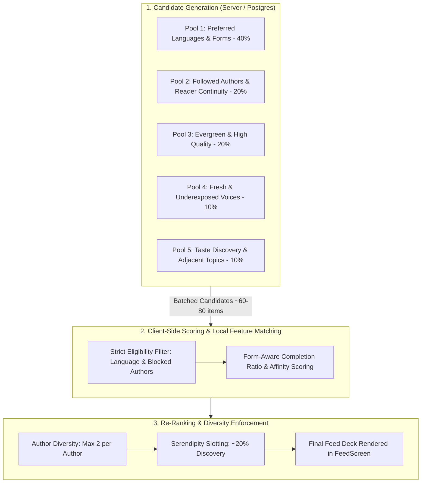

# WritOn — Predictive Reading Recommendation Engine Architecture
**Document Version:** 2.0.0 (Pragmatic Architecture Revision)  
**Status:** Approved Architectural Blueprint  
**Domain:** Content Discovery, Reader Retention & Personalization  

---

## 1. Executive Summary & Philosophy

WritOn is a multilingual literary platform (English, Hindi, Marathi, Bengali) built as a **quiet, distraction-free sanctuary for deep reading and craft-focused writing**.

Unlike standard algorithmic feeds that optimize for rapid doom-scrolling, high-frequency reactions, and sensational outrage, WritOn's recommendation model is designed as **"The Quiet Library Architecture"**:
1. **Separation of Concerns:** Distinct separation between **Candidate Generation** (server-side query across diverse pools), **Scoring** (client-side feature matching), and **Re-Ranking** (diversity, author throttling, and serendipity).
2. **Language as Eligibility, Not Weight:** Explicit reader language selections serve as strict pruning boundaries, not soft scores that bleed unwanted scripts into a curated session.
3. **Respect Reader Pace & Form:** Reading depth is normalized against form-specific expectations (poetry vs. essays), comparing items only within their respective form cohorts.
4. **Preserve Evergreen Literature:** Stories do not degrade in quality simply by aging. Freshness is a bounded, transient bonus; evergreen literature remains permanently discoverable.
5. **Bot & Persona Quarantine:** All automated agent interactions, bot dispatches, and synthetic seed engagements are strictly quarantined from human learning models.

---

## 2. End-to-End Three-Stage Recommendation Pipeline

---

## 3. Stage 1: Multi-Pool Candidate Generation (Server-Side)

A client-side re-ranker is useless if the server only hands it the 50 most recent posts. The server generates candidate batches (total ~60–80 items) by sampling from 5 targeted candidate pools:

| Pool | Target Allocation | Query Logic & Purpose |
| :--- | :--- | :--- |
| **1. Familiar Reading** | **40%** (~28 stories) | Matches user's explicit language preferences and top 2 frequented categories over the last 30 days. |
| **2. Reader Continuity** | **20%** (~14 stories) | Recent publications from followed authors or authors with multiple 30s+ dwell sessions by the reader. |
| **3. Evergreen Library** | **20%** (~14 stories) | High-retention, high-applause pieces across all time with sustained reading completion, regardless of age. |
| **4. Underexposed Voices** | **10%** (~7 stories) | Newly published writers with < 5 reads, giving every new story a baseline opportunity window for discovery. |
| **5. Serendipity / Adjacent** | **10%** (~7 stories) | High-performing stories in adjacent categories within the reader's approved languages to broaden taste. |

---

## 4. Stage 2: Feature Scoring & Measurement Normalization

### A. Language Eligibility (Strict Pruning vs. Soft Affinity)
- **Eligibility (Hard Filter):** Stories in languages not selected by the reader are pruned at query time. A reader who selected English & Hindi will never be served Bengali or Marathi candidates.
- **Affinity (Soft Ranking):** Within an approved language, the system learns script and sub-dialect nuances (e.g., Devanagari Hindi vs. Romanized Hindi, or classical prose vs. modern micro-poetry).

### B. Form-Aware Reading Depth (Poetry vs. Long-Form Essays)
To prevent a 4-line poem from unfairly beating a 2,000-word reflective essay, engagement is calculated via **Normalized Time Coverage** and **Cohort Percentiles**:

1. **Estimated Reading Seconds ($T_{\text{expected}}$):**
   $$T_{\text{expected}} = \max\left(T_{\text{floor}}, \frac{\text{Word Count}}{200 \text{ WPM}} \times 60\right)$$
   - **Poem Floor ($T_{\text{floor}}$):** 8 seconds.
   - **Flash Fiction Floor ($T_{\text{floor}}$):** 20 seconds.
   - **Essay Floor ($T_{\text{floor}}$):** 45 seconds.

2. **Time Coverage Ratio:**
   $$\text{Coverage} = \min\left(1.0, \frac{\text{Active Foreground Seconds}}{T_{\text{expected}}}\right)$$
   *Note: Active foreground reading tracks window focus, scroll continuity, and resumed reading sessions. Leaving a screen open without interaction is capped.*

3. **Cohort Comparison:**
   - Raw completion rates are never compared across different forms.
   - A story's completion score is evaluated relative to its **form cohort** (percentile among poems vs. percentile among essays).

### C. The Scoring Function (Within Eligible Candidates)
$$\text{Score} = (\text{FormCohortPercentile} \times 0.35) + (\text{CategoryAffinity} \times 0.25) + (\text{AuthorAffinity} \times 0.20) + (\text{FreshnessBonus}) + (\text{QualityBase})$$

- **Freshness Bonus (Bounded & Decay-Isolated):**
  $$\text{FreshnessBonus} = \beta \cdot 2^{-\frac{\text{Age in Days}}{h}}$$
  - Half-life $h = 2.5 \text{ days}$.
  - Weight $\beta = 0.15$ (maximum contribution is strictly capped so older masterpieces remain competitive).
- **Quality Base (Decay-Free):**
  $$\text{QualityBase} = \frac{\text{Completed Reads}}{\text{Total Opens}} \times 0.7 + \frac{\text{Bookmarks}}{\text{Completed Reads}} \times 0.3$$

---

## 5. Stage 3: Re-Ranking & Guardrails

Before rendering the feed to the reader:

1. **Author Diversity Throttling:**
   - Maximum **2 stories per author** in any single 30-card feed session. Prevents prolific posters from crowding out community voices.
2. **Serendipity Window (~20%):**
   - Roughly 1 in 5 cards is designated as an exploration item (drawn from Pool 4 or Pool 5). Discovery means encountering a new poet or fresh voice in a favorite language, not an unwanted language.
3. **Session Fatigue & Deduplication:**
   - Stories dismissed or fully read in the last 72 hours are pushed to the bottom of the deck.
4. **"Continue Reading" Separation:**
   - Partially read long essays (>30% coverage, unfinished) are surfaced in a dedicated, prominent *"Continue Reading"* shelf, isolated from the algorithmic discovery deck.

---

## 6. WritOn Safeguard: Persona & Bot Interaction Quarantine

WritOn utilizes autonomous background publishers, seed accounts, and agent validation routines.
- **Rule:** Telemetry events originating from automated test suites, background cron tasks, or synthetic developer accounts MUST include `is_synthetic: true`.
- **Ingestion Quarantine:** The analytics and recommendation aggregation pipelines explicitly drop all records where `is_synthetic == true` or `user_id IN (persona_allowlist)`.
- **Protection:** Prevents artificial popularity spikes and self-reinforcing recommendation loops driven by platform automation.

---

## 7. Implementation Roadmap

| Phase | Scope | Deliverables |
| :--- | :--- | :--- |
| **Phase 1: Backend Candidate Pooling & Pruning** | Server / API | Update `/api/v1/posts/feed` to query across 5 pools with language eligibility constraints rather than raw `created_at desc`. |
| **Phase 2: Client Dwell Normalization** | Android App | Enhance `WritOnTelemetry.kt` to record active foreground reading duration against form-specific word-count benchmarks. |
| **Phase 3: Client-Side Re-Ranker** | Android App | Implement local preference vector in `UserPreferences` and lightweight in-memory scoring in `FeedViewModel`. |
| **Phase 4: Persona Quarantine** | Telemetry & Database | Add `is_synthetic` flags to automated posting and QA suites; verify telemetry pipelines ignore synthetic engagement. |
