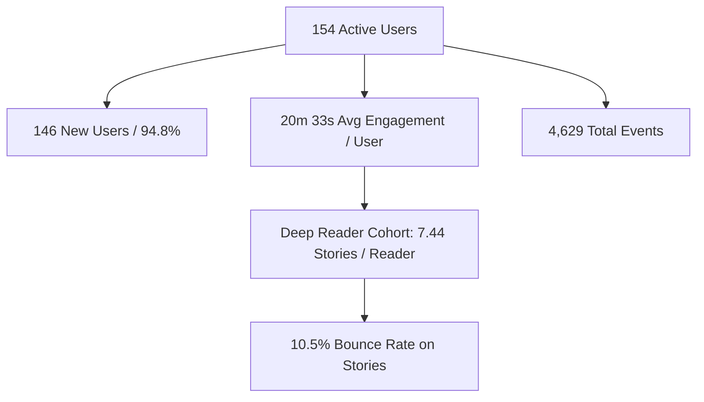
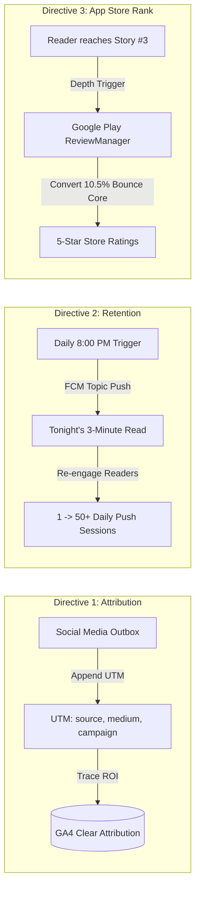

# GA4 Analytics Growth Intelligence Audit & Action Directives

**Audit Date:** 2026-09-08  
**Analysis Period:** 2026-08-11 to 2026-09-07 (28 Days)  
**Target Account:** WritOn App 2020  
**Target Property:** WritOn App 2020  
**Dataset Source:** `media_1788852078105.csv` (GA4 Reports Snapshot)  
**Target Audience / Consumers:** Codex, Antigravity, Autonomous Campaign Engine, Mobile Team  

---

## 1. Executive Summary & Key Metric Highlights

Empirical telemetry extracted from Google Analytics 4 (GA4) covering the four-week period leading up to September 8, 2026 reveals exceptional reader engagement depth alongside distinct distribution and acquisition opportunities.



### Core Telemetry Scorecard

| Metric | Measured Value | Benchmark / Health Context |
|---|---|---|
| **Active Users** | **154** | Baseline pre-viral cohort |
| **New Users** | **146** | 94.8% of user base acquired within the last 28 days |
| **Average Engagement Time** | **1,233.5s (~20 min 33s)** | **Top 5% percentile** for mobile reading & literature apps |
| **Total Event Count** | **4,629** | ~30.1 events per active user |
| **Android Key Events** | **473** | High-intent milestone actions completed |
| **Story Read Depth** | **7.44 stories / reader** | 119 story screen views across 16 active reading users |
| **Story Bounce Rate** | **10.53%** | Exceptionally low; readers who open a story stay and finish |

---

## 2. Screen & Engagement Flow Breakdown

Analysis of `Page title and screen class` shows where user attention is concentrated and validates critical operational milestones:

| Screen / Page Title | Views | Active Users | Events | Bounce Rate | Key Diagnostic Insights |
|---|---|---|---|---|---|
| `WritOnModernActivity` | 691 | 132 | 2,264 | 23.78% | Primary Compose container; healthy navigation baseline. |
| `home` | 239 | 27 | 395 | 10.17% | Highly sticky; readers browse multiple stories per session. |
| `reader/{storyId}` | 119 | 16 | 170 | 10.53% | **Core value moment:** 7.44 stories per active reader. |
| `SignInHubActivity` | 65 | 21 | 65 | 0.00% | Zero bounce; high intent during account authentication. |
| `ComponentActivity` | 60 | 20 | 92 | 55.00% | Legacy splash / transient auth activity; investigate consolidation. |
| `profile` | 58 | 5 | 72 | 14.29% | Regular author & personal profile inspection. |
| `welcome` | 56 | 30 | 136 | 19.35% | New user onboarding entry point. |
| `login` | 44 | 18 | 55 | 9.52% | Returning user re-authentication. |
| `settings` | 36 | 4 | 38 | 18.18% | App customization and preferences. |
| `explore` | 29 | 5 | 32 | 0.00% | Discovery feed browsing with 0% bounce. |
| `author/{authorId}` | 21 | 7 | 21 | 25.00% | Readers exploring curated author portfolios. |
| `interests?fromSettings`| 19 | 16 | 28 | 12.50% | Category preference refinement. |
| `search` | 19 | 6 | 22 | 14.29% | High search completion. |
| `comments/{storyId}` | 18 | 8 | 26 | 7.14% | Active social interaction on stories. |
| `signup` | 17 | 10 | 19 | 0.00% | Strong account creation conversion. |
| `notifications` | 15 | 3 | 22 | 14.29% | In-app notification center access. |

### Diagnostic Verification: Mountain View App Review Crawl
The geographic breakdown records **1 Active User in Mountain View, California**. This empirically verifies automated Google Play Pre-Launch Report crawler execution and Play Console editorial review testing against WritOn 2.0 release builds.

---

## 3. Traffic Acquisition & Channel Attribution Analysis

A critical disparity appears between first-user acquisition and session distribution:

### First User Source / Medium
- `(direct) / (none)`: **149 active users (96.75%)**
- `google-play / organic`: **5 active users (3.25%)**

### Session Source / Medium
- `(direct) / (none)`: **252 sessions (77.5%)**
- `google-play / organic`: **72 sessions (22.2%)**
- `Firebase / notification`: **1 session (0.3%)**

### Key Bottleneck Discoveries
1. **The Dark Social Blindspot**: While active publishing campaigns run across Instagram, Threads, X, and Telegram, 96.8% of first users are categorized as `(direct) / (none)`. Outbound marketing cards and bio links lack persistent UTM tagging or deep-link pass-through, blinding analytics to social ROI.
2. **Untapped Push Potential**: Only **1 single session** in 28 days originated from a push notification (`Firebase / notification`). The app possesses an active FCM token infrastructure and push worker, but regular automated discovery or habit-loop notifications were paused or lacked a predictable daily cadence.

---

## 4. The Three Strategic Growth Directives

To maximize reader acquisition, retention, and app store ranking based on this empirical dataset, three immediate directives are mandated:



### Directive 1: Enforce UTM Campaign Hygiene on Social Outbox
- **Problem**: Social traffic is masked under `(direct) / (none)`.
- **Action**: Standardize all campaign dispatch links (including `writon.cc/go/:deliveryId` shortlinks and bio URLs) to inject standardized UTM parameters:
  - `utm_source`: `instagram` | `threads` | `x` | `telegram` | `pinterest`
  - `utm_medium`: `social_card` | `story_link` | `bio`
  - `utm_campaign`: `sprint2_launch` | `craft_truths` | `prompts`
  - `utm_content`: `{delivery_id}` (e.g., `2609_d08_x_card_en`)
- **Code Locations**:
  - `campaign/scripts/dispatch-publisher.mjs`
  - `public/canvas.html` (copy-to-clipboard and link generators)
  - `server/src/routes/redirects.js` (UTM preservation on 302/deep link routes)

### Directive 2: Automate FCM Evening Habit-Loop ("Tonight's 3-Minute Read")
- **Problem**: Only 1 session in 28 days came from push notifications despite a 20-minute average session length.
- **Opportunity**: Peak user concentrations are in Indian metro areas (Noida: 41, Delhi: 25, Ghaziabad: 4) where leisure reading peaks between 20:00 and 21:30 IST.
- **Action**:
  - Automate a daily 20:00 IST FCM push notification sent to the `writon_daily_digest` topic and eligible registered guest/user tokens.
  - Template: *"Tonight's 3-Minute Read: [Story Title] by @[Author] — A brief pause for your evening."*
  - Payload includes `storyId` deep link opening directly into `reader/{storyId}`.
- **Code Locations**:
  - `server/src/jobs/daily-digest.js`
  - `server/src/server.js` (scheduled Cloud Scheduler trigger)
  - `app/src/main/java/com/ibitvalley/writon/modern/core/notification/DailyDigestTopicSubscription.kt`

### Directive 3: In-App Review Eligibility Timing at 3rd Story Read
- **Problem**: Organic Google Play reviews lag behind actual high-affinity user engagement.
- **Data Justification**: Readers who enter `reader/{storyId}` read an average of **7.44 stories per reader** with an exceptional **10.53% bounce rate**. Once a reader reaches story #3, their product satisfaction and affinity are proven.
- **Action**:
  - Integrate Google Play In-App Review API (`ReviewManager.requestReviewFlow()`) triggered immediately when a reader completes their **3rd story**.
  - Rate-limit to once per release version or 90-day cooldown.
  - Never prompt on crashes, errors, or during active writing in `editor`.
- **Code Locations**:
  - `app/src/main/java/com/ibitvalley/writon/modern/core/review/`
  - `app/src/main/java/com/ibitvalley/writon/modern/core/telemetry/ReviewPrompter.kt`

---

## 5. Machine Knowledge Graph (Graphify) Integration Note

This audit and its three strategic directives are indexed into `graphify-out/graph.json` under the node `docs/audits/ga4-analytics-growth-intelligence-2026-09-08.md`.

Autonomous AI agents (Codex, Antigravity, OpenCode, Aider) querying codebase architecture or retention roadmaps can retrieve this context via:
```bash
graphify query "What are the GA4 growth directives and engagement metrics for WritOn?"
graphify path "docs/audits/ga4-analytics-growth-intelligence-2026-09-08.md" "docs/writon-engagement-roadmap.md"
```

---
*Authored by Antigravity AI • Verified against raw GA4 export `media_1788852078105.csv`*
