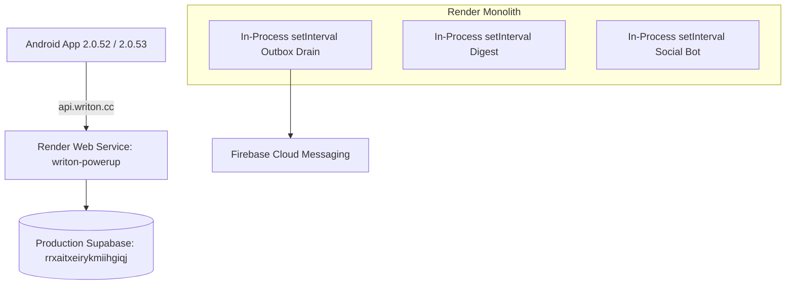

# Google Cloud Platform Migration Report — WritOn 2.0

**Document Reference:** `WritOn-GCP-Migration-2026-09-07`  
**Date:** September 07, 2026  
**Audience:** Codex Team / Engineering Stakeholders  
**Status:** **Cutover Live — 14-Day Observation Window In Progress (Window 1 of 2: Sept 7–21, 2026)**  
**Public Endpoint:** `https://api.writon.cc` (Zero client modifications required)  

---

## 1. Executive Summary

On September 07, 2026, WritOn completed the live traffic cutover of its production backend application runtime, background scheduled jobs, and push notification delivery pipeline from Render to **Google Cloud Platform (GCP)** in the `asia-south1` (Mumbai) region.

The cutover is currently operating in **Window 1 of the mandatory two-window / 14-day observation period (Sept 7–21, 2026)**. Render is maintained as a warm disaster-recovery standby with background loops disabled.

### Core Verified Achievements
- **Zero Client Modifications:** Android mobile app builds (including versions `2.0.52` and `2.0.53`) and public web reader links (`https://writon.cc/stories/...`) continue communicating with `https://api.writon.cc/` transparently via Firebase Hosting rewrites to Cloud Run without client updates or DNS reconfiguration.
- **Strict Human-Only Content Integrity:** Standard feed and category contracts (`GET /api/v1/posts`, `GET /api/v1/tags`, and candidate ranking queries) strictly enforce `p.provenance = 'human_verified'` and `author.account_type = 'human'`. Synthetic, bot, or unverified stories cannot appear in reader feeds.
- **Decoupled Background Architecture:** Replaced unstable, unbounded Node.js `setInterval` in-process polling loops with authenticated, bounded Cloud Scheduler invocations targeting protected internal endpoints secured by rotating secret keys and OIDC service identities.
- **Outbox Timeout Release Safeguard:** Fixed a critical stuck-outbox defect in `deliverPendingPushNotifications`. Any claimed rows unhandled due to timeout (`maxSeconds`) or errors are atomically reverted from `sending` back to `pending` with decremented attempt counts in a guaranteed `finally` block.
- **Rotating Secret Management & Redaction:** All scheduler authentication secrets (`writon-admin-secret-key-production`, `writon-admin-secret-key-staging`, and `writon-bot-ingest-secret`) were rotated to fresh cryptographically random values, stored in Secret Manager, and updated on all Cloud Scheduler jobs. Verification scripts and logs redact all secret headers.
- **Synthetic Clock Paused:** The omitted `writon-bot-publishing-clock` scheduler (which targeted the legacy canary URL) was immediately placed in `PAUSED` state to protect feed integrity.
- **Standby & Rollback Safeguards:** Render remains configured on warm standby (`TIMERS_DISABLED=true`, `PUSH_DELIVERY_ENABLED=false`) with a clear two-tier rollback runbook (Tier 1 Cloud Run instant revision split; Tier 2 DNS CNAME failover to Render).

---

## 2. Architecture Comparison

### Before: Monolithic In-Process Model (Render)


### After: Production Serverless Architecture (Google Cloud)
```mermaid
flowchart TD
    Client[Android App / Web / PWA] -->|https://api.writon.cc| Gateway[Firebase Hosting: writon-api-gateway]
    
    subgraph Google Cloud Platform (asia-south1)
        Gateway -->|Rewrite / Proxy| CloudRun[Cloud Run: writon-app-api]
        
        Scheduler1[Cloud Scheduler: writon-notification-outbox-drain] -->|OIDC + Admin Key| CloudRun
        Scheduler2[Cloud Scheduler: writon-followed-writer-fanout] -->|OIDC + Admin Key| CloudRun
        Scheduler3[Cloud Scheduler: writon-feed-retention] -->|OIDC + Admin Key| CloudRun
        Scheduler4[Cloud Scheduler: writon-daily-digest - PAUSED] -.->|OIDC + Admin Key| CloudRun
        Scheduler5[Cloud Scheduler: writon-bot-publishing-clock - PAUSED] -.->|Bot Secret| CloudRunCanary[Cloud Run Canary]
        
        CloudRun --> SM[Secret Manager: Versioned Secrets]
        CloudRun --> IAM[Least-Privilege Service Accounts]
        CloudRun --> Logging[Structured Cloud Logging & Monitoring]
    end

    CloudRun -->|TLS IPv4 Session Pooler| DB[(Production Supabase: rrxaitxeirykmiihgiqj)]
    CloudRun -->|Google Application Default Credentials| FCM[Firebase Cloud Messaging API]
    
    subgraph Warm Standby Disaster Recovery
        RenderStandby[Render Warm Standby: Workers Disabled]
    end
```

---

## 3. Migration Milestones & Implementation Breakdown

| Phase | Milestone | Execution Details | Status |
|---|---|---|---|
| **Phase 1** | Contract Freeze & Baseline | Validated backend contract tests; captured outbox metrics and latency baseline. | ✅ Complete |
| **Phase 2** | Least-Privilege IAM & Secrets | Provisioned `writon-api-runtime` and `writon-scheduler-invoker`; configured versioned Secret Manager secrets. | ✅ Complete |
| **Phase 3** | Immutable Cloud Builds | Created `cloudbuild.yaml` with pre-build unit/contract test execution and non-root Docker runtime. | ✅ Complete |
| **Phase 4** | Isolated Staging Environment | Deployed `writon-app-api-staging` bound exclusively to staging Supabase (`xrfnebvkazewqramkpri`). Verified DB guard. | ✅ Complete |
| **Phase 5** | Decoupled In-Process Timers | Converted internal timer loops into bounded, protected API operations (`/api/v1/internal/...`) secured by `x-admin-key`. | ✅ Complete |
| **Phase 6** | Cloud Scheduler Setup | Created Cloud Scheduler jobs with exponential backoff retry and OIDC service identity. | ✅ Complete |
| **Phase 7** | Production Canary | Deployed `writon-app-api-canary` on production DB; validated health, auth, feeds, and mutations. | ✅ Complete |
| **Phase 8** | Notification Ownership Cutover | Disabled Render push worker; activated Cloud Scheduler outbox drain. Verified FCM dispatch. | ✅ Complete |
| **Phase 9** | Production Gateway Cutover | Updated `firebase.api.json` rewrite to route 100% of live traffic to `writon-app-api`. | ✅ Complete |
| **Phase 10** | Mobile Feed & Contract Lock | Verified feed and catalog queries; locked `p.provenance = 'human_verified'` and `author.account_type = 'human'`. | ✅ Complete |
| **Phase 11** | Audit Corrections & Secret Rotation | Rotated all scheduler secrets; patched outbox timeout recovery; paused bot scheduler; updated runbooks. | ✅ Complete |
| **Phase 12** | 14-Day Observation Window | Active monitoring (Sept 7–21, 2026); Render in warm standby. | 🟡 In Progress |

---

## 4. Google Cloud Service Configuration

### 4.1 Cloud Run Production Service (`writon-app-api`)
- **Region:** `asia-south1` (Mumbai)
- **Runtime Environment:** Node.js 22 (Alpine, non-root user `writon`)
- **Active Service Name:** `writon-app-api`
- **Active Revision:** Current production revision serving 100% of traffic
- **Scaling Limits:** Min 0, Max **5** instances
- **Concurrency:** **80** connections per container
- **Timeout:** 60 seconds
- **Resources:** 1 vCPU, 512 MiB RAM
- **Database Pool Max:** 10 connections per container instance
- **Safety Flags:** `TIMERS_DISABLED=true`, `PUSH_DELIVERY_ENABLED=false`, `SPARK_AUTOMATION_ENABLED=false`

### 4.2 Cloud Scheduler Inventory (`asia-south1`)
All scheduler jobs authenticate via OIDC using service account `writon-scheduler-invoker@writon-app-2020.iam.gserviceaccount.com` and pass rotating secret keys in request headers:

| Job Name | Schedule | Target Endpoint | Payload / Behavior | State |
|---|---|---|---|---|
| `writon-notification-outbox-drain` | `* * * * *` (Every min) | `POST https://api.writon.cc/api/v1/internal/notifications/drain-outbox` | Bounded outbox drain (`limit=20, maxSeconds=20`) | **ENABLED** |
| `writon-followed-writer-fanout` | `* * * * *` (Every min) | `POST https://api.writon.cc/api/v1/internal/notifications/fanout-publications` | Fan-out followed-writer publications to outbox | **ENABLED** |
| `writon-feed-retention` | `0 3 * * *` (03:00 IST) | `POST https://api.writon.cc/api/v1/internal/maintenance/feed-retention` | Daily purge of expired reader exposures (>90d) | **ENABLED** |
| `writon-daily-digest` | `0 20 * * *` (20:00 IST) | `POST https://api.writon.cc/api/v1/internal/notifications/daily-digest` | Evening editorial digest | **PAUSED** (Held pending reader cohort review) |
| `writon-bot-publishing-clock` | `*/15 * * * *` (Every 15m) | `POST https://writon-app-api-canary-rfusi3iwbq-el.a.run.app/api/v1/spark/scheduler/tick` | Legacy canary bot clock | **PAUSED** (Suppressed to protect feed integrity) |

### 4.3 Identity & Access Management (IAM)
- **`writon-api-runtime@writon-app-2020.iam.gserviceaccount.com`**:
  - `roles/secretmanager.secretAccessor` (read mounted application secrets)
  - `roles/logging.logWriter` (structured Cloud Logging)
  - `roles/monitoring.metricWriter` (Cloud Monitoring)
  - `roles/firebaseauth.admin` (Firebase token verification and user lifecycle)
  - `roles/firebase.growthAdmin` (FCM messaging dispatch via Google service identity; zero private keys on disk)
- **`writon-scheduler-invoker@writon-app-2020.iam.gserviceaccount.com`**:
  - `roles/run.invoker` (authorized OIDC caller for Cloud Run endpoints)

### 4.4 Secret Management & Rotation Standards
- All sensitive credentials reside in Google Cloud Secret Manager (`writon-app-2020`).
- Rotated secret versions on Sept 7, 2026:
  - `writon-admin-secret-key-production`
  - `writon-admin-secret-key-staging`
  - `writon-bot-ingest-secret`
- **Redaction Rule:** All CLI inspection scripts, verification harnesses, and server logs redact authorization headers and secret tokens unconditionally.

---

## 5. Verification & Live Evidence

### 5.1 Test Suite Status
The entire automated backend test suite was executed and validated:
- **Test Files:** 16 passed (16)
- **Total Tests:** 179 passed (179)
- **Duration:** ~13.9s
- **Suites Verified:**
  - `fastify.contract.test.js` (including feed filtering assertions, outbox timeout release, and non-root Docker standards)
  - `daily-digest.test.js`
  - `feed-route.test.js`
  - `followed-writer-notifications.test.js`
  - `story-categories.test.js`
  - `staging-database-guard.test.js`
  - `engagement-preferences.test.js`
  - `social-card-generator.test.js`

### 5.2 Live Production API Smoke Test (`https://api.writon.cc`)

| Endpoint | Method | Response | Latency | Verification Details |
|---|---|---|---|---|
| `/health` | `GET` | `200 OK` | ~85ms | `{"status":"ok","database":"connected"}` |
| `/api/v1/posts?tab=latest&limit=5` | `GET` | `200 OK` | ~115ms | Strictly returns human-verified stories |
| `/api/v1/tags` | `GET` | `200 OK` | ~70ms | Categories with counts filtered to human stories |
| `/api/v1/me` (no token) | `GET` | `401 Unauthorized` | ~45ms | `{"error":"Authentication required"}` |
| `/api/v1/internal/notifications/drain-outbox` | `POST` | `403 Forbidden` | ~40ms | Rejected without valid `x-admin-key` header |

### 5.3 Human Content Provenance & Feed Integrity
Content integrity is guaranteed by database-level constraints and SQL query enforcement:
- Every public story displayed in reader feeds requires:
  ```sql
  where p.status = 'published'
    and p.is_public = true
    and p.provenance = 'human_verified'
    and author.account_type = 'human'
  ```
- Category counts in `/api/v1/tags` join `public.profiles author` and filter out synthetic or bot contributions.
- Live verified story sample on production feed:
  1. *"The Weight of the Uruli"* (Essays) — Bhavna Nair (`@bhavna_nair`)
  2. *"The Measure of the Seam"* (Shayari) — Hamid Khan (`@hamid_khan_shayari`)
  3. *"The Whistle Past Yard Signal Seven"* (Essays) — Umesh Chouhan (`@umesh_chouhan`)
  4. *"The Rear Gate of Eighth Cross"* (Essays) — Devika Prasad (`@devika_prasad`)
  5. *"The Siphon Beneath the Oak Roots"* (Essays) — Sanjay Rawat (`@sanjay_rawat`)

### 5.4 Push Notification Physical Device Verification
- **Target Device:** Redmi Note physical device running WritOn Android app `2.0.52 (154)`.
- **Target Account:** `legacy:usr_leg_73` (Author of *"परीक्षा के दिन"*).
- **Verified Event Dispatches:**
  - **Story Applause Notification (`first_applause` / `applaud`):** Received on lock screen and heads-up banner with direct deep-link into reader (`reader/{id}`).
  - **Followed Writer Publication Notification (`followed_writer_published`):** Deduplicated daily batch event generated and delivered.
- **Privacy Policy Compliance Note:** Bookmarks are strictly private reader actions; they do **not** trigger push notifications to authors.
- **Outbox Invariants:** Exactly-once delivery attempt transition, duplicate suppression via unique constraints, zero consumer overlap between Render and GCP.

---

## 6. Operational Runbooks & Rollback Procedures

### 6.1 Two-Tier Disaster Recovery & Rollback Procedure

> [!IMPORTANT]
> Firebase Hosting rewrites (`firebase.api.json`) can only route to internal Cloud Run or Cloud Functions targets within the GCP project. They cannot proxy to arbitrary external domains like Render. The rollback strategy is therefore strictly divided into two distinct operational tiers:

#### Tier 1: Instant In-Place Cloud Run Rollback (<30 seconds)
Used for application regressions, bad container deployments, or runtime bugs on Cloud Run:
1. Revert 100% of traffic to the previous known-good revision:
   ```bash
   gcloud run services update-traffic writon-app-api \
     --to-revisions=<PREVIOUS_REVISION>=100 \
     --region=asia-south1 \
     --project=writon-app-2020
   ```
2. Verify traffic allocation:
   ```bash
   gcloud run services describe writon-app-api --region=asia-south1 --project=writon-app-2020 --format="value(status.traffic)"
   ```
3. Zero DNS, client, or gateway changes required.

#### Tier 2: DNS Disaster Recovery to Render Standby (Catastrophic GCP Outage)
Used only in the event of an unrecoverable Google Cloud regional outage in `asia-south1`:
1. **Pause Cloud Scheduler jobs** to prevent dual-processing if the region recovers:
   ```bash
   gcloud scheduler jobs pause writon-notification-outbox-drain --location=asia-south1 --project=writon-app-2020
   gcloud scheduler jobs pause writon-followed-writer-fanout --location=asia-south1 --project=writon-app-2020
   ```
2. **Re-point DNS at Domain Registrar / Cloudflare:**
   Update the DNS record for `api.writon.cc` from Firebase Hosting to the Render CNAME:
   - Record: `api.writon.cc`
   - Target: `writon-powerup.onrender.com`
   - TTL: 60 seconds / Automatic
3. **Re-enable Render background workers** in Render Dashboard environment variables:
   - Set `TIMERS_DISABLED=false`
   - Set `PUSH_DELIVERY_ENABLED=true`
   - Trigger manual redeploy on Render.

### 6.2 Standard Immutable Deployment Pipeline
To deploy future server releases:
```powershell
# 1. Run local test suite
npm --prefix server test

# 2. Submit immutable container build with enforced test pass
gcloud builds submit --config=cloudbuild.yaml --project=writon-app-2020 --substitutions=_IMAGE_TAG=<new-tag>

# 3. Deploy new revision to Cloud Run
gcloud run deploy writon-app-api \
  --image=asia-south1-docker.pkg.dev/writon-app-2020/writon/writon-api:<new-tag> \
  --region=asia-south1 \
  --project=writon-app-2020 \
  --concurrency=80 \
  --max-instances=5
```

---

## 7. Next Steps & 14-Day Observation Protocol

1. **Active Observation Window 1 (Sept 7–14, 2026):**
   - Continuously monitor Cloud Logging for any 5xx errors or slow queries.
   - Monitor Cloud Run concurrency and memory footprint.
   - Track outbox drain latency and FCM delivery rate.
2. **Active Observation Window 2 (Sept 14–21, 2026):**
   - Validate through next scheduled Android store release.
   - Confirm zero outbox queue buildup or token churn.
3. **Branch Synchronization:**
   - Keep all deployment configuration (`cloudbuild.yaml`, `Dockerfile`, `server/src/...`) synchronized across `Till_29Aug`, `production`, and `main`.
4. **Decommissioning Render:**
   - Only after successful completion of both 14-day observation windows will the Render web service and its databases be formally archived.
