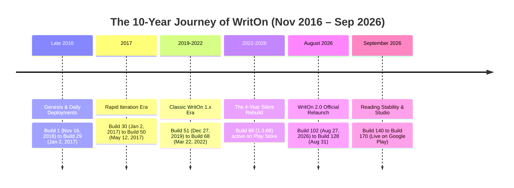

# Google Play Release Chronicle — The 10-Year Journey of WritOn (2016 – Present)

**Package**: `com.ibitvalley.writon`  
**Database Table**: `public.app_releases` (PostgreSQL)  
**Current Live Production Release**: `2.0.71` (Version Code `170`), Released September 15, 2026, 12:23 PM IST  
**Genesis Release**: `1.0` (Version Code `1`), Released November 16, 2016, 11:05 AM IST  
**Total Production Releases**: 80 recorded releases spanning nearly 10 continuous years  

---

## 1. Platform Epochs & Decadal Architecture



1. **Epoch I — The Genesis Era (2016 – 2017, Builds 1–50)**:
   - **48 production releases** in the database.
   - Initial debut: **Version 1.0 (Build 1)** launched on November 16, 2016 at 11:05 AM IST.
   - Rapid early feedback loops with releases shipping every few days (Build 1 to 29 in late 2016, Builds 30 to 50 in early 2017).
   - Culminated in the long-running stable milestone **Build 50 (`1.3.45`)** deployed May 12, 2017.
2. **Epoch II — The Classic 1.x Era (2019 – 2022, Builds 51–68)**:
   - **15 production releases** in the database.
   - Re-activated modern community authoring on December 27, 2019 (`1.3.46`, Build 51).
   - Powered literary writing through the pandemic surge (Builds 52–58 in 2020, Builds 62–66 in late 2020–2021).
   - Culminated in **Build 68 (`1.3.68`)** released March 22, 2022, which remained active on Google Play for **4 years and 5 months** as the foundation of the original legacy community.
3. **Epoch III — Modern WritOn 2.0 (August 2026 – Present, Builds 102–170)**:
   - **17 production releases** in the database.
   - Official launch: **Version 2.0.0 (Build 102)** on August 27, 2026 at 8:41 PM IST.
   - Complete modernization of reader feeds, markdown rendering, offline cache, and zero-distraction writing desk.
   - Currently active on Google Play: **`2.0.71` (Build 170)** released September 15, 2026 at 12:23 PM IST.

---

## 2. Complete Database Ledger (`public.app_releases`)

### Era III: Modern WritOn 2.0 (August 2026 – Present) — 17 Releases

| Version Code | Version Name | Release Date & Time (IST) | Internal Release Title | Status |
| :--- | :--- | :--- | :--- | :--- |
| **170** | **2.0.71** | Sep 15, 2026, 12:23 PM | `170 (2.0.71)` | **available_on_google_play (Live)** |
| **164** | **2.0.65** | Sep 13, 2026, 11:03 AM | `164 (2.0.65)` | replaced |
| **163** | **2.0.64** | Sep 11, 2026, 12:37 PM | `163 (2.0.64) - WritOn: Read, Write & Socialize` | replaced |
| **154** | **2.0.52** | Sep 6, 2026, 10:43 PM | `154 (2.0.52) Sep 06 - WritOn Story Writing & Reads` | replaced |
| **143** | **2.0.41** | Sep 3, 2026, 5:23 PM | `2.0.41 - Story Management & Reliability` | replaced |
| **140** | **2.0.38** | Sep 3, 2026, 12:52 PM | `2.0.38 - Personalisation & Reliability` | replaced |
| **128** | **2.0.26** | Aug 31, 2026, 5:53 PM | `128 (2.0.26)` | replaced |
| **126** | **2.0.23** | Aug 31, 2026, 11:21 AM | `2.0.23 - Story Studio, Offline Sync & Multi-Lang` | replaced |
| **122** | **2.0.20** | Aug 31, 2026, 9:42 AM | `2.0.20 - WritOn 2.0 Studio & Growth Launch` | replaced |
| **113** | **2.0.11** | Aug 30, 2026, 10:49 AM | `113 (2.0.11)` | replaced |
| **112** | **2.0.10** | Aug 30, 2026, 8:03 AM | `112 (2.0.10)` | replaced |
| **111** | **2.0.9** | Aug 30, 2026, 2:00 AM | `111 (2.0.9)` | replaced |
| **108** | **2.0.6** | Aug 29, 2026, 8:44 PM | `108 (2.0.6)` | replaced |
| **106** | **2.0.4** | Aug 29, 2026, 1:05 AM | `106 (2.0.4)` | replaced |
| **104** | **2.0.2** | — | `104` | draft_candidate |
| **103** | **2.0.1** | Aug 27, 2026, 11:23 PM | `WritOn 2.0.1 (Build 103)` | replaced |
| **102** | **2.0.0** | Aug 27, 2026, 8:41 PM | `102 (2.0.0) — WritOn 2.0 Debut` | replaced (is_major) |

---

### Era II: Classic 1.x Era (2019 – 2022) — 15 Releases

| Version Code | Version Name | Release Date & Time (IST) | Replaced Date & Time (IST) | Status |
| :--- | :--- | :--- | :--- | :--- |
| **68** | **1.3.68** | Mar 22, 2022, 3:17 PM | Aug 27, 2026, 8:41 PM | replaced (**Live for 4.4 years**) |
| **67** | **1.3.67** | — | Mar 22, 2022, 3:17 PM | draft_candidate |
| **66** | **1.3.66** | Dec 26, 2021, 5:54 AM | Mar 22, 2022, 3:17 PM | replaced |
| **65** | **1.3.65** | — | Dec 26, 2021, 5:54 AM | draft_candidate |
| **64** | **64** | — | Dec 26, 2021, 5:54 AM | draft_candidate |
| **63** | **1.3.63** | Nov 1, 2020, 11:03 AM | Dec 26, 2021, 5:54 AM | replaced |
| **62** | **1.3.62** | Nov 1, 2020, 10:52 AM | Nov 1, 2020, 11:03 AM | replaced |
| **58** | **1.3.54** | May 10, 2020, 10:09 PM | Nov 1, 2020, 10:52 AM | replaced |
| **57** | **1.3.53** | May 10, 2020, 8:05 PM | May 10, 2020, 10:09 PM | replaced |
| **56** | **1.3.52** | Apr 2, 2020, 1:42 AM | May 10, 2020, 8:05 PM | replaced |
| **55** | **1.3.55** | Apr 1, 2020, 4:34 PM | Apr 2, 2020, 1:42 AM | replaced |
| **54** | **1.3.49** | Feb 14, 2020, 12:06 PM | Apr 1, 2020, 4:34 PM | replaced |
| **53** | **1.3.48** | Feb 6, 2020, 1:53 AM | Feb 14, 2020, 12:06 PM | replaced |
| **52** | **1.3.47** | Jan 28, 2020, 11:20 AM | Feb 6, 2020, 1:53 AM | replaced |
| **51** | **1.3.46** | Dec 27, 2019, 8:44 AM | Jan 28, 2020, 11:20 AM | replaced |

---

### Era I: Genesis Era (2016 – 2017) — 48 Releases

| Version Code | Version Name | Release Date & Time (IST) | Replaced Date & Time (IST) | Status |
| :--- | :--- | :--- | :--- | :--- |
| **50** | **1.3.45** | May 12, 2017, 3:05 AM | Dec 27, 2019, 8:44 AM | replaced (Live 2.5 years) |
| **49** | **1.3.45** | May 12, 2017, 3:05 AM | May 12, 2017, 3:05 AM | replaced |
| **48** | **1.3.44.a** | May 12, 2017, 2:13 AM | May 12, 2017, 3:05 AM | replaced |
| **46** | **1.3.43** | Apr 12, 2017, 2:21 AM | May 12, 2017, 2:13 AM | replaced |
| **45** | **1.3.42** | Apr 1, 2017, 5:56 PM | Apr 12, 2017, 2:21 AM | replaced |
| **44** | **1.3.41** | Mar 31, 2017, 10:45 AM | Apr 1, 2017, 5:56 PM | replaced |
| **43** | **1.3.40** | Mar 27, 2017, 10:02 AM | Mar 31, 2017, 10:45 AM | replaced |
| **42** | **1.3.39** | Feb 17, 2017, 1:27 AM | Mar 27, 2017, 10:02 AM | replaced |
| **41** | **1.3.38** | Feb 2, 2017, 11:30 AM | Feb 17, 2017, 1:27 AM | replaced |
| **40** | **1.3.37** | Feb 2, 2017, 9:56 AM | Feb 2, 2017, 11:30 AM | replaced |
| **39** | **1.3.36** | Jan 16, 2017, 10:11 PM | Feb 2, 2017, 9:56 AM | replaced |
| **38** | **1.3.35** | Jan 14, 2017, 11:45 PM | Jan 16, 2017, 10:11 PM | replaced |
| **36** | **1.3.33** | Jan 14, 2017, 12:42 PM | Jan 14, 2017, 11:45 PM | replaced |
| **35** | **1.3.32** | Jan 11, 2017, 10:19 AM | Jan 14, 2017, 12:42 PM | replaced |
| **34** | **1.3.31** | Jan 9, 2017, 11:27 AM | Jan 11, 2017, 10:19 AM | replaced |
| **33** | **1.3.30** | Jan 9, 2017, 4:19 AM | Jan 9, 2017, 11:27 AM | replaced |
| **32** | **1.3.29** | Jan 8, 2017, 5:39 AM | Jan 9, 2017, 4:19 AM | replaced |
| **31** | **1.3.28** | Jan 4, 2017, 2:37 AM | Jan 8, 2017, 5:39 AM | replaced |
| **30** | **1.3.27** | Jan 2, 2017, 10:30 AM | Jan 4, 2017, 2:37 AM | replaced |
| **29** | **1.3.26** | Jan 2, 2017, 1:48 AM | Jan 2, 2017, 10:30 AM | replaced |
| **28** | **1.3.25** | Jan 1, 2017, 5:00 AM | Jan 2, 2017, 1:48 AM | replaced |
| **27** | **1.3.24** | Dec 30, 2016, 3:20 AM | Jan 1, 2017, 5:00 AM | replaced |
| **26** | **1.3.23** | Dec 28, 2016, 1:37 AM | Dec 30, 2016, 3:20 AM | replaced |
| **25** | **1.3.22** | Dec 27, 2016, 10:18 AM | Dec 28, 2016, 1:37 AM | replaced |
| **24** | **1.3.21** | Dec 26, 2016, 1:50 AM | Dec 27, 2016, 10:18 AM | replaced |
| **23** | **1.3.20** | Dec 23, 2016, 10:47 AM | Dec 26, 2016, 1:50 AM | replaced |
| **22** | **1.3.19** | Dec 20, 2016, 2:11 AM | Dec 23, 2016, 10:47 AM | replaced |
| **21** | **1.3.18** | Dec 19, 2016, 3:47 AM | Dec 20, 2016, 2:11 AM | replaced |
| **20** | **1.3.17** | Dec 18, 2016, 11:45 AM | Dec 19, 2016, 3:47 AM | replaced |
| **19** | **1.3.16** | Dec 16, 2016, 3:25 AM | Dec 18, 2016, 11:45 AM | replaced |
| **18** | **1.3.15** | Dec 14, 2016, 2:33 AM | Dec 16, 2016, 3:25 AM | replaced |
| **17** | **1.3.14** | Dec 12, 2016, 3:15 AM | Dec 14, 2016, 2:33 AM | replaced |
| **16** | **1.3.13** | Dec 10, 2016, 3:24 AM | Dec 12, 2016, 3:15 AM | replaced |
| **15** | **1.3.12** | Dec 9, 2016, 4:07 AM | Dec 10, 2016, 3:24 AM | replaced |
| **14** | **1.3.11** | Dec 7, 2016, 4:12 AM | Dec 9, 2016, 4:07 AM | replaced |
| **13** | **1.3.10** | Dec 6, 2016, 10:25 AM | Dec 7, 2016, 4:12 AM | replaced |
| **12** | **1.3.9** | Dec 4, 2016, 4:25 PM | Dec 6, 2016, 10:25 AM | replaced |
| **11** | **1.3.8** | Dec 2, 2016, 2:41 AM | Dec 4, 2016, 4:25 PM | replaced |
| **10** | **1.3.7** | Nov 30, 2016, 4:33 AM | Dec 2, 2016, 2:41 AM | replaced |
| **9** | **1.3.6** | Nov 29, 2016, 1:43 AM | Nov 30, 2016, 4:33 AM | replaced |
| **8** | **1.3.5** | Nov 28, 2016, 3:33 AM | Nov 29, 2016, 1:43 AM | replaced |
| **7** | **1.3.4** | Nov 28, 2016, 2:56 AM | Nov 28, 2016, 3:33 AM | replaced |
| **6** | **1.3.3** | Nov 25, 2016, 11:02 AM | Nov 28, 2016, 2:56 AM | replaced |
| **5** | **1.3.2** | Nov 25, 2016, 12:50 AM | Nov 25, 2016, 11:02 AM | replaced |
| **4** | **1.3.1** | Nov 20, 2016, 11:48 PM | Nov 25, 2016, 12:50 AM | replaced |
| **3** | **1.3** | Nov 20, 2016, 2:34 AM | Nov 20, 2016, 11:48 PM | replaced |
| **2** | **1.1** | Nov 18, 2016, 10:21 AM | Nov 20, 2016, 2:34 AM | replaced |
| **1** | **1.0** | Nov 16, 2016, 11:05 AM | Nov 18, 2016, 10:21 AM | replaced (**Genesis Launch**, is_major) |

---

## 3. Database Schema Contract

```sql
CREATE TABLE public.app_releases (
  id UUID PRIMARY KEY DEFAULT gen_random_uuid(),
  platform TEXT NOT NULL DEFAULT 'android',
  package_name TEXT NOT NULL DEFAULT 'com.ibitvalley.writon',
  version_code INTEGER NOT NULL,
  version_name TEXT NOT NULL,
  release_title TEXT,
  released_at TIMESTAMPTZ,
  replaced_at TIMESTAMPTZ,
  status TEXT NOT NULL,
  era TEXT NOT NULL,
  is_major BOOLEAN NOT NULL DEFAULT false,
  raw_metadata JSONB NOT NULL DEFAULT '{}'::jsonb,
  created_at TIMESTAMPTZ NOT NULL DEFAULT NOW(),
  updated_at TIMESTAMPTZ NOT NULL DEFAULT NOW(),
  CONSTRAINT app_releases_platform_code_unique UNIQUE (platform, version_code)
);
```
