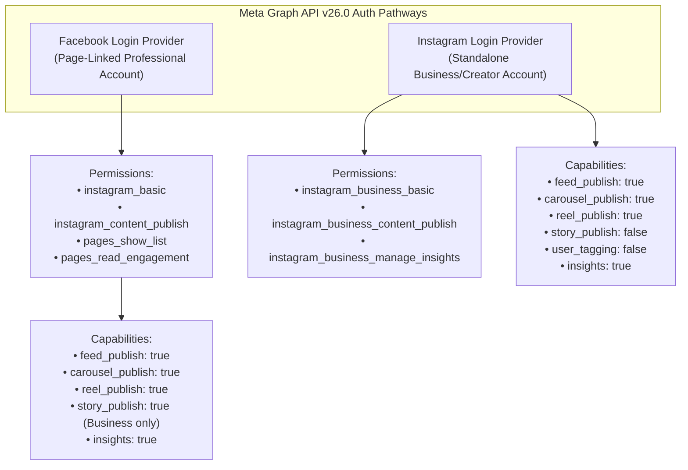
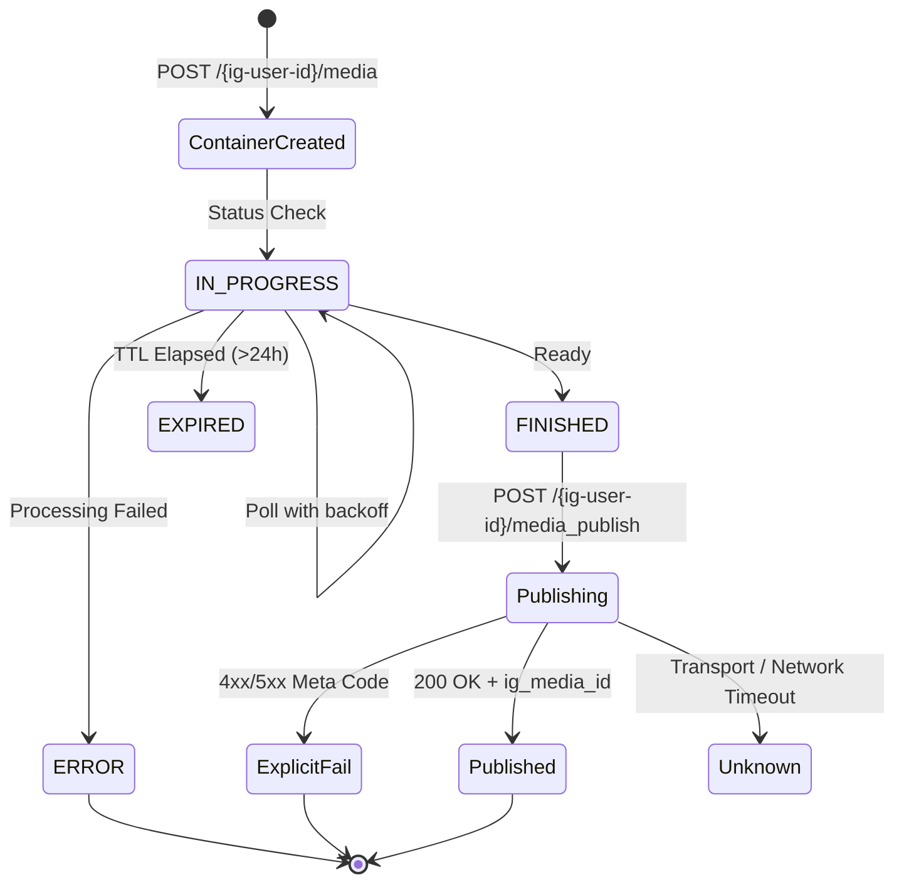

# Meta Graph API v26.0 Protocol Contract (`instagram_platform_contract.md`)

> **Protocol Version**: Meta Graph API `v26.0` (Released July 29, 2026; configurable via `META_GRAPH_API_VERSION`).  
> **Target Subsystem**: WritOn Autonomous Multi-Channel Editorial Fleet • Instagram Specialist.

---

## 1. Authentication & Permission Topology

Meta maintains two materially distinct authorization pathways for Instagram programmatic publishing. The WritOn Instagram Bot subsystem requires explicit provider configuration and reflects runtime capabilities.



### 1.1 Long-Lived Token Exchange & Refresh
1. Short-lived User Access Token ($\sim 1\text{--}2\text{ hours}$) is exchanged for a Long-Lived Access Token ($\sim 60\text{ days}$):
   ```http
   GET https://graph.facebook.com/v26.0/oauth/access_token?
     grant_type=fb_exchange_token&
     client_id={app-id}&
     client_secret={app-secret}&
     fb_exchange_token={short-lived-token}
   ```
2. Tokens must be refreshed before expiry ($\le 15\text{ days}$ remaining) via:
   ```http
   GET https://graph.facebook.com/v26.0/oauth/access_token?
     grant_type=ig_refresh_token&
     access_token={long-lived-token}
   ```

---

## 2. Dynamic Publishing Quotas & Health Monitoring

Meta enforces publishing rate limits per connected account. Never hardcode static limits.

### 2.1 Content Publishing Limit Endpoint
```http
GET https://graph.facebook.com/v26.0/{ig-user-id}/content_publishing_limit?fields=config,quota_usage
```
Response format:
```json
{
  "data": [
    {
      "quota_usage": 8,
      "config": {
        "quota_total": 50,
        "quota_duration": 86400
      }
    }
  ]
}
```
*Operational Sentinel*: If `quota_usage / quota_total >= 0.8`, the bot transitions to warning state. At `1.0`, publishing jobs are safely queued and rejected before sending requests to Meta.

---

## 3. Asynchronous Container Lifecycle State Machine

Publishing any media to Instagram via Graph API v26.0 is an asynchronous two-step process: **Container Creation** $\to$ **Container Status Polling** $\to$ **Publishing**.



### 3.1 Step 1: Container Creation
- **Feed Image (Single)**:
  `POST /{ig-user-id}/media` $\to$ `{ image_url, caption }`
- **Feed Carousel**:
  1. For each slide: `POST /{ig-user-id}/media` $\to$ `{ image_url, is_carousel_item: true }` $\to$ returns child `id`.
  2. For carousel parent: `POST /{ig-user-id}/media` $\to$ `{ media_type: "CAROUSEL", children: [child_ids...], caption }`.
- **Reel Video**:
  `POST /{ig-user-id}/media` $\to$ `{ media_type: "REELS", video_url, caption }`.
- **Story (Uninteractive)**:
  `POST /{ig-user-id}/media` $\to$ `{ media_type: "STORIES", image_url | video_url }`.
  *(Note: Interactive Story stickers such as link stickers are not supported via Content Publishing API in v26.0; marked `MANUAL FINISH REQUIRED`)*.

### 3.2 Step 2: Polling Container Status
```http
GET https://graph.facebook.com/v26.0/{container-id}?fields=status_code,status
```
Status Codes:
- `IN_PROGRESS`: Video rendering or image asset transcoding. Re-poll using backoff.
- `FINISHED`: Container is ready for immediate atomic publishing.
- `ERROR`: Terminal error during container processing.
- `EXPIRED`: Container was not published within 24 hours of creation.

### 3.3 Step 3: Atomic Media Publish
```http
POST https://graph.facebook.com/v26.0/{ig-user-id}/media_publish
{
  "creation_id": "{container-id}",
  "access_token": "{token}"
}
```
- **Success**: Returns `{ "id": "{ig-media-id}" }`.
- **Explicit Failure**: Returns `{ "error": { "code": ..., "error_subcode": ..., "message": ... } }`.
- **Transport Ambiguity**: Network disconnect or timeout before response $\to$ record `TIMEOUT_UNKNOWN` and initiate reconciliation.

---

## 4. Format-Specific Media Capability Matrix (`MediaCapabilityMatrix`)

| Format | Allowed MIME Types | Codecs / Audio | Max File Size | Duration | Recommended Dimensions / Ratio |
| :--- | :--- | :--- | :--- | :--- | :--- |
| **Feed Image** | `image/jpeg` | sRGB color profile | $8\text{ MB}$ | — | 1:1 ($1080\times 1080$), 4:5 ($1080\times 1350$) |
| **Carousel Image**| `image/jpeg` | sRGB color profile | $8\text{ MB}$ / slide | — | 4:5 ($1080\times 1350$) uniform aspect |
| **Carousel Video**| `video/mp4`, `video/quicktime`| H.264/HEVC + AAC | $1\text{ GB}$ / slide | $3\text{s}\text{--}60\text{s}$ | 4:5 ($1080\times 1350$), $23\text{--}60\text{ FPS}$ |
| **Reel** | `video/mp4`, `video/quicktime`| H.264/HEVC + AAC | $1\text{ GB}$ | $3\text{s}\text{--}15\text{ min}$| 9:16 ($1080\times 1920$), $23\text{--}60\text{ FPS}$ |
| **Story** | `image/jpeg`, `video/mp4` | H.264 + AAC | Image: $8\text{ MB}$, Video: $100\text{ MB}$ | Video $\le 60\text{s}$ | 9:16 ($1080\times 1920$) |

---

## 5. Views-Centric Metric Capability Matrix

Meta v22.0+ deprecated `impressions` in favor of `views`. Metric calls in v26.0 query format-specific fields.

```http
GET https://graph.facebook.com/v26.0/{ig-media-id}?fields=like_count,comments_count,views,reach,saved,shares,total_interactions
```
When fields are unsupported for a given media format (e.g. `saved` on certain Story formats), the returned payload will omit them. In the WritOn database, omitted fields are recorded as `NULL`, strictly distinct from a reported `0`.
